# DPOS - Data Product Operating System

## Complete Technical Documentation

**Platform:** Full-Stack Data Governance with AI-Powered Agents

---

## Table of Contents

1. [Executive Summary](#1-executive-summary)
2. [System Architecture](#2-system-architecture)
3. [Technology Stack](#3-technology-stack)
4. [Backend Architecture](#4-backend-architecture)
5. [AI Agents System](#5-ai-agents-system)
6. [Data Models](#6-data-models)
7. [Neo4j Graph Database](#7-neo4j-graph-database)
8. [Data Contracts & SLAs](#8-data-contracts--slas)
9. [API Reference](#9-api-reference)
10. [MCP Server Integration](#10-mcp-server-integration)
11. [Frontend Architecture](#11-frontend-architecture)
12. [Configuration & Environment](#12-configuration--environment)
13. [Testing Strategy](#13-testing-strategy)
14. [Deployment Guide](#14-deployment-guide)

---

## 1. Executive Summary

### 1.1 What is DPOS?

DPOS (Data Product Operating System) is a comprehensive data governance platform that combines:

- **Data Mesh Architecture**: Treating data as a product with clear ownership
- **AI-Powered Governance**: 12+ LangGraph agents for automated decision-making
- **Knowledge Graph**: Neo4j-based lineage tracking and impact analysis
- **Contract-Based Quality**: Enforceable data contracts with SLAs
- **Human-in-the-Loop**: Critical decisions require human approval

### 1.2 Key Features

```
+------------------+     +------------------+     +------------------+
|  Data Products   |---->|   AI Agents      |---->|  Governance      |
|  - Catalog       |     |  - Healing       |     |  - Contracts     |
|  - Schemas       |     |  - Discovery     |     |  - SLAs          |
|  - Lineage       |     |  - Impact        |     |  - Policies      |
|  - Ownership     |     |  - Insights      |     |  - Compliance    |
+------------------+     +------------------+     +------------------+
```

### 1.3 Core Capabilities

| Capability | Description |
|------------|-------------|
| **Data Catalog** | Centralized registry of all data products with metadata |
| **Lineage Tracking** | End-to-end data flow visualization |
| **Contract Validation** | Automated quality rule enforcement |
| **Incident Management** | Detection, analysis, and remediation |
| **AI-Powered Insights** | LLM-enhanced governance recommendations |
| **MCP Integration** | Claude Desktop integration for natural language queries |

---

## 2. System Architecture

### 2.1 High-Level Architecture Diagram

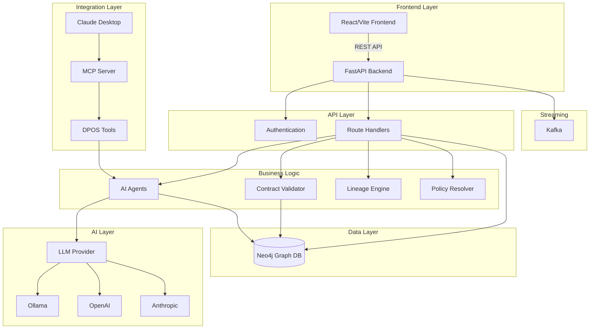

### 2.2 Component Interaction Flow

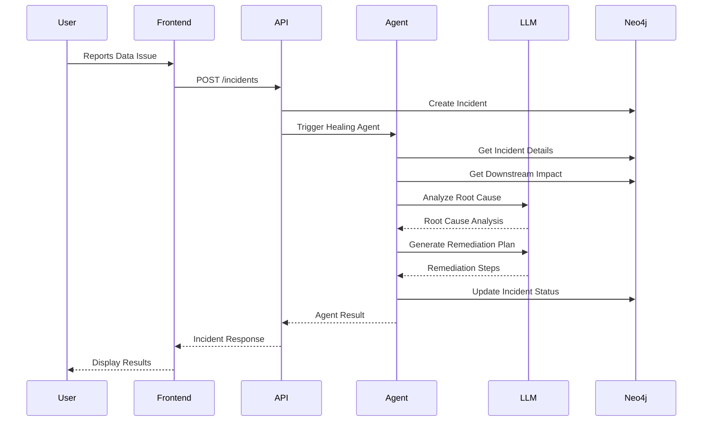

### 2.3 Data Flow Architecture

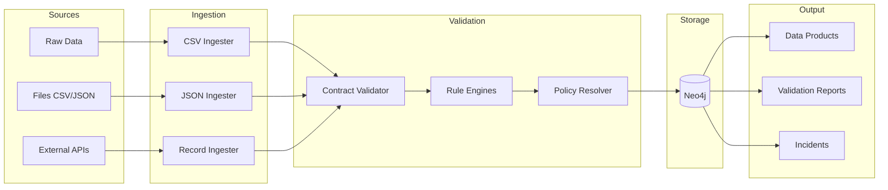

---

## 3. Technology Stack

### 3.1 Backend Technologies

| Component | Technology | Version | Purpose |
|-----------|------------|---------|---------|
| **Framework** | FastAPI | 0.104+ | Async REST API |
| **Database** | Neo4j | 5.x | Graph database |
| **AI Framework** | LangGraph | 0.2+ | Agent orchestration |
| **LLM** | Ollama/OpenAI/Anthropic | Latest | AI inference |
| **Validation** | Pydantic | 2.x | Data validation |
| **Auth** | JWT | - | Token authentication |
| **Streaming** | Kafka | 3.x | Event streaming |

### 3.2 Frontend Technologies

| Component | Technology | Version | Purpose |
|-----------|------------|---------|---------|
| **Framework** | React | 18.2 | UI framework |
| **Bundler** | Vite | 5.0 | Build tool |
| **Styling** | TailwindCSS | 3.3 | CSS framework |
| **State** | TanStack Query | 5.8 | Server state |
| **Routing** | React Router | 6.20 | Client routing |
| **HTTP** | Axios | 1.6 | API client |
| **Icons** | Lucide React | 0.294 | Icon library |

### 3.3 Infrastructure

```
+-------------------+     +-------------------+     +-------------------+
|   Docker          |     |   Neo4j           |     |   Kafka           |
|   - API Container |     |   - bolt://7687   |     |   - 9092          |
|   - Dev/Prod      |     |   - Graph Store   |     |   - Events        |
+-------------------+     +-------------------+     +-------------------+
```

---

## 4. Backend Architecture

### 4.1 Project Structure

```
src/
├── api/                    # FastAPI application
│   ├── main.py            # Application entry point
│   └── routes/            # API route handlers
│       ├── agents.py      # AI agent endpoints
│       ├── auth.py        # Authentication
│       ├── contracts.py   # Contract management
│       ├── domains.py     # Domain management
│       ├── incidents.py   # Incident handling
│       ├── intelligence.py # Graph RAG endpoints
│       ├── lineage.py     # Lineage tracking
│       ├── marketplace.py # Product marketplace
│       ├── metrics.py     # Metrics & health
│       ├── pipelines.py   # Pipeline management
│       ├── policies.py    # Policy enforcement
│       ├── products.py    # Product catalog
│       ├── slas.py        # SLA monitoring
│       ├── tags.py        # Tagging system
│       └── users.py       # User management
├── agents/                 # LangGraph AI agents
├── contracts/             # Contract validation
├── core/                  # Core infrastructure
├── graph/                 # Neo4j database layer
├── models/                # Pydantic data models
├── mcp/                   # MCP server
└── ...
```

### 4.2 FastAPI Application (main.py)

```python
"""
DPOS API - Data Product Operating System
Main FastAPI application with security, middleware, and all routes.
"""
from fastapi import FastAPI
from fastapi.middleware.cors import CORSMiddleware
from contextlib import asynccontextmanager

from src.core.config import settings
from src.core.middleware import (
    RequestLoggingMiddleware,
    RateLimitMiddleware,
    RequestValidationMiddleware,
    SecurityHeadersMiddleware,
    ErrorHandlingMiddleware
)

@asynccontextmanager
async def lifespan(app: FastAPI):
    """Application lifespan manager."""
    # Startup: Initialize resources
    from src.graph.manager import Neo4jManager
    with Neo4jManager() as mgr:
        mgr.init_schema()

    yield

    # Shutdown: Cleanup resources

app = FastAPI(
    title="DPOS API",
    description="Data Product Operating System",
    version="2.0.0",
    lifespan=lifespan
)

# Middleware stack (order matters)
app.add_middleware(ErrorHandlingMiddleware)
app.add_middleware(SecurityHeadersMiddleware)
app.add_middleware(RequestValidationMiddleware)
app.add_middleware(RateLimitMiddleware,
    requests_per_minute=100, burst=20)
app.add_middleware(RequestLoggingMiddleware)
app.add_middleware(CORSMiddleware,
    allow_origins=settings.cors_origins_list,
    allow_credentials=True,
    allow_methods=["GET", "POST", "PUT", "DELETE", "PATCH"])

# Include all routers
app.include_router(auth.router, prefix="/api/auth")
app.include_router(products.router, prefix="/api/products")
app.include_router(agents.router, prefix="/api/agents")
# ... (16 total routers)
```

### 4.3 Middleware Stack

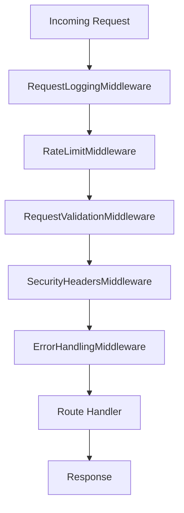

| Middleware | Purpose |
|------------|---------|
| **RequestLoggingMiddleware** | Logs all requests with timing |
| **RateLimitMiddleware** | 100 req/min with burst of 20 |
| **RequestValidationMiddleware** | Validates request structure |
| **SecurityHeadersMiddleware** | Adds security headers |
| **ErrorHandlingMiddleware** | Global error handling |

### 4.4 Health Check Endpoint

```python
@app.get("/health")
def health():
    """Comprehensive health check endpoint."""
    status = {
        "status": "healthy",
        "version": "2.0.0",
        "checks": {
            "api": {"status": "healthy"},
            "database": {"status": "unknown"},
            "llm": {"status": "unknown"},
            "kafka": {"status": "unknown"}
        }
    }

    # Check Neo4j
    with Neo4jManager() as mgr:
        mgr.execute_query("RETURN 1")
        status["checks"]["database"] = {"status": "healthy"}

    # Check LLM availability
    llm = get_llm_if_available()
    if llm and llm.is_available:
        status["checks"]["llm"] = {
            "status": "healthy",
            "providers": llm.available_providers
        }

    return status
```

---

## 5. AI Agents System

### 5.1 Agent Architecture Overview

DPOS includes 12+ LangGraph-based AI agents for automated governance:

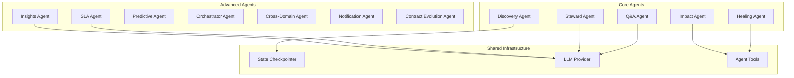

### 5.2 Agent Summary Table

| Agent | Purpose | LLM-Enhanced | Human-in-Loop |
|-------|---------|--------------|---------------|
| **Discovery** | Find and catalog data products | No | No |
| **Q&A** | Natural language questions | Yes | No |
| **Healing** | Auto-remediate data issues | Yes | Yes (critical) |
| **Steward** | Governance recommendations | Yes | No |
| **Impact** | Downstream impact analysis | Yes | No |
| **SLA** | Monitor SLA compliance | Yes | No |
| **Insights** | Generate governance insights | Yes | No |
| **Predictive** | Predict future issues | Yes | No |
| **Orchestrator** | Coordinate multiple incidents | Yes | Yes |
| **Cross-Domain** | Cross-boundary impact | Yes | No |
| **Notification** | Stakeholder notifications | Yes | No |
| **Contract Evolution** | Suggest contract improvements | Yes | No |

### 5.3 Healing Agent (Detailed)

The Healing Agent automatically remediates data quality issues using LLM-powered analysis.

#### State Definition

```python
class HealingAgentState(TypedDict):
    """State for the self-healing agent."""
    incident_id: str
    severity: str
    product_id: Optional[str]
    product_name: Optional[str]

    # LLM-enhanced analysis
    diagnosis: Optional[str]
    root_cause: Optional[str]
    root_cause_factors: Optional[List[str]]
    root_cause_confidence: Optional[str]

    # Severity reassessment
    assessed_severity: Optional[str]
    severity_changed: bool
    urgency: Optional[str]

    # Remediation
    recommendation: str
    remediation_steps: Optional[List[str]]
    action: str
    fallback_available: bool

    # Human-in-the-loop
    requires_approval: bool
    approved: bool
    escalation_needed: bool

    # Narrative for stakeholders
    incident_narrative: Optional[str]

    status: str
    messages: Annotated[List[BaseMessage], add]
```

#### Agent Flow Diagram

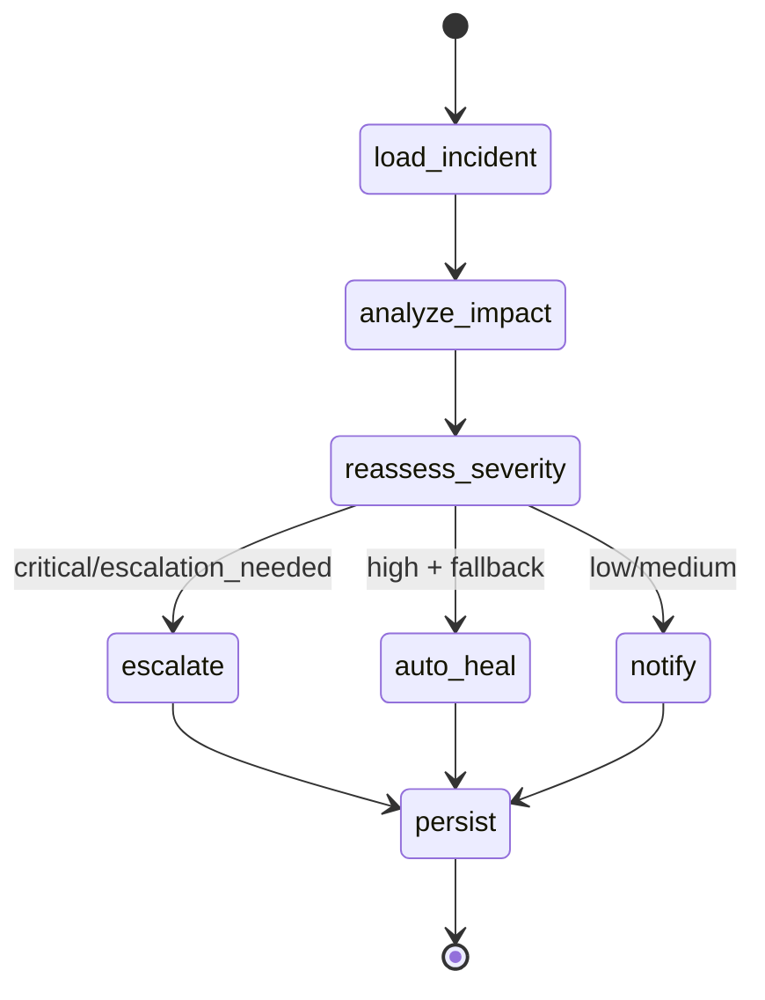

#### Agent Builder Code

```python
def build_healing_agent():
    """Build an enhanced self-healing agent with LLM capabilities."""
    log = get_agent_logger("HealingAgent")

    def load_incident(state: HealingAgentState) -> HealingAgentState:
        """Load incident details."""
        details = get_incident_details.invoke(state["incident_id"])
        return {
            **state,
            "product_id": details.get("product_id"),
            "product_name": details.get("product_name"),
            "diagnosis": details.get("description"),
            "status": "incident_loaded"
        }

    def analyze_impact(state: HealingAgentState) -> HealingAgentState:
        """Analyze impact with LLM enhancement."""
        impact = get_downstream_impact.invoke(state["product_id"])
        fallback_info = check_pipeline_fallback.invoke(state["product_id"])

        # LLM-powered root cause analysis
        root_cause_result = analyze_root_cause.invoke(
            incident_id=state["incident_id"],
            incident_type="data_quality_issue",
            description=state.get("diagnosis", "Unknown issue"),
            affected_product=state.get("product_name"),
            severity=state.get("severity", "medium")
        )

        return {
            **state,
            "root_cause": root_cause_result.get("root_cause"),
            "root_cause_confidence": root_cause_result.get("confidence"),
            "fallback_available": fallback_info.get("has_fallback"),
            "status": "impact_analyzed"
        }

    def route_by_severity(state) -> Literal["escalate", "auto_heal", "notify"]:
        """Route based on assessed severity."""
        severity = state.get("assessed_severity") or state.get("severity")
        has_fallback = state.get("fallback_available", False)

        if severity == "critical" or state.get("escalation_needed"):
            return "escalate"
        elif severity == "high" and has_fallback:
            return "auto_heal"
        return "notify"

    # Build the graph
    graph = StateGraph(HealingAgentState)

    graph.add_node("load_incident", load_incident)
    graph.add_node("analyze_impact", analyze_impact)
    graph.add_node("reassess_severity", reassess_incident_severity)
    graph.add_node("escalate", escalate_to_human)
    graph.add_node("auto_heal", auto_heal)
    graph.add_node("notify", notify_steward)
    graph.add_node("persist", persist_execution)

    graph.set_entry_point("load_incident")
    graph.add_edge("load_incident", "analyze_impact")
    graph.add_edge("analyze_impact", "reassess_severity")

    graph.add_conditional_edges(
        "reassess_severity",
        route_by_severity,
        {"escalate": "escalate", "auto_heal": "auto_heal", "notify": "notify"}
    )

    graph.add_edge("escalate", "persist")
    graph.add_edge("auto_heal", "persist")
    graph.add_edge("notify", "persist")
    graph.add_edge("persist", END)

    return graph.compile(checkpointer=get_checkpointer())
```

### 5.4 SLA Monitoring Agent

The SLA Agent monitors compliance and predicts breaches.

#### Agent Flow

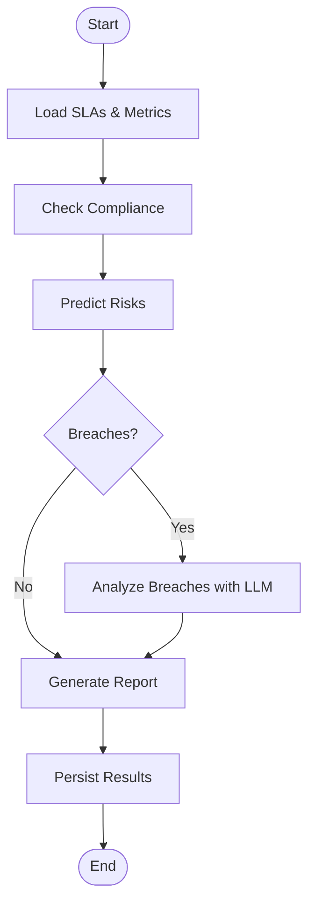

#### Key Functions

```python
def _analyze_sla_breach_with_llm(sla: dict, metrics: dict) -> dict:
    """Use LLM to analyze SLA breach and provide recommendations."""
    llm = get_llm_if_available()

    if llm:
        prompt = f"""Analyze this SLA breach and provide recommendations:

SLA Details:
- Name: {sla.get('sla_name')}
- Metric Type: {sla.get('metric_type')}
- Target Value: {sla.get('target_value')}
- Threshold: {sla.get('threshold')}
- Product: {sla.get('product_name')}

Current Metrics:
{metrics}

Provide:
1. Root cause analysis
2. Immediate action to take
3. Long-term fix recommendation
4. Estimated time to resolution"""

        response = llm.invoke(prompt)
        return parse_llm_response(response)

    # Non-LLM fallback
    return {
        "root_cause": f"SLA {sla.get('metric_type')} threshold exceeded",
        "immediate_action": "Check data pipeline health",
        "long_term_fix": "Implement alerting thresholds",
        "estimated_resolution": "30 minutes to 2 hours"
    }
```

### 5.5 Insights Agent

Generates automated governance insights and recommendations.

#### Analysis Pipeline

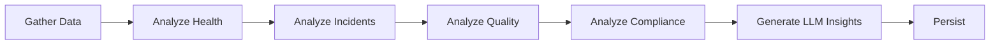

#### Sample Output

```json
{
  "executive_summary": "Data governance health is currently GOOD with
    85% compliance rate. 3 products require attention.",
  "key_findings": [
    "15 total data products monitored",
    "2 open incidents (0 critical)",
    "Contract compliance at 85%"
  ],
  "recommendations": [
    "Add contracts to 3 unprotected products",
    "Review Customer data product health",
    "Schedule quarterly SLA review"
  ],
  "risk_areas": [
    {"area": "Unprotected Products", "reason": "3 products lack contracts"}
  ],
  "alerts": [
    {
      "type": "low_compliance",
      "severity": "warning",
      "message": "Contract compliance is at 85%"
    }
  ]
}
```

### 5.6 Agent Tools

Shared tools used across agents:

```python
# src/agents/tools/common_tools.py

@tool
def get_incident_details(incident_id: str) -> dict:
    """Get detailed information about an incident."""
    with Neo4jManager() as mgr:
        query = """
        MATCH (i:Incident {id: $id})
        OPTIONAL MATCH (i)<-[:HAS_INCIDENT]-(p:DataProduct)
        RETURN i.id as id, i.type as type, i.severity as severity,
               i.status as status, i.description as description,
               p.id as product_id, p.name as product_name
        """
        result = mgr.execute_query(query, {"id": incident_id})
        return dict(result[0]) if result else {}

@tool
def get_downstream_impact(product_id: str) -> dict:
    """Get downstream impact of a product failure."""
    with Neo4jManager() as mgr:
        query = """
        MATCH (p:DataProduct {id: $id})
        OPTIONAL MATCH (consumer:DataProduct)-[:CONSUMES_FROM*1..3]->(p)
        OPTIONAL MATCH (consumer)-[:HAS_STEWARD]->(u:User)
        RETURN collect(DISTINCT {
            id: consumer.id,
            name: consumer.name,
            domain: consumer.domain_id
        }) as downstream_consumers,
        count(DISTINCT u) as affected_users
        """
        result = mgr.execute_query(query, {"id": product_id})
        return dict(result[0]) if result else {}

@tool
def analyze_root_cause(
    incident_id: str,
    incident_type: str,
    description: str,
    affected_product: str,
    severity: str
) -> dict:
    """Use LLM to analyze root cause of an incident."""
    llm = get_llm_if_available()

    if llm:
        prompt = f"""Analyze this data quality incident:

Type: {incident_type}
Severity: {severity}
Product: {affected_product}
Description: {description}

Provide:
1. Most likely root cause
2. Contributing factors (list 3-5)
3. Confidence level (low/medium/high)"""

        response = llm.invoke(prompt)
        return parse_root_cause_response(response)

    return {
        "root_cause": "Unable to determine without LLM",
        "factors": [],
        "confidence": "low"
    }
```

### 5.7 LLM Provider Integration

```python
# src/core/llm.py

class UnifiedLLM:
    """Unified LLM interface with automatic provider fallback."""

    def __init__(
        self,
        config: Optional[LLMConfig] = None,
        preferred_provider: Optional[LLMProvider] = None,
        enable_cache: bool = True
    ):
        self.config = config or LLMConfig()
        self._providers: List[BaseLLMProvider] = []
        self._initialize_providers()

    def _initialize_providers(self):
        """Initialize providers in order of preference."""
        provider_classes = {
            LLMProvider.OLLAMA: OllamaProvider,
            LLMProvider.OPENAI: OpenAIProvider,
            LLMProvider.ANTHROPIC: AnthropicProvider
        }

        for provider_type, provider_class in provider_classes.items():
            provider = provider_class(self.config)
            if provider.is_available:
                self._providers.append(provider)

    def invoke(self, prompt: str, system_prompt: str = None) -> LLMResponse:
        """Invoke LLM with automatic fallback."""
        for provider in self._providers:
            try:
                return provider.invoke(prompt, system_prompt)
            except Exception:
                continue
        raise RuntimeError("All LLM providers failed")

# Usage
llm = get_llm_if_available()
if llm:
    response = llm.invoke("Analyze this data quality issue...")
```

---

## 6. Data Models

### 6.1 Core Models Overview

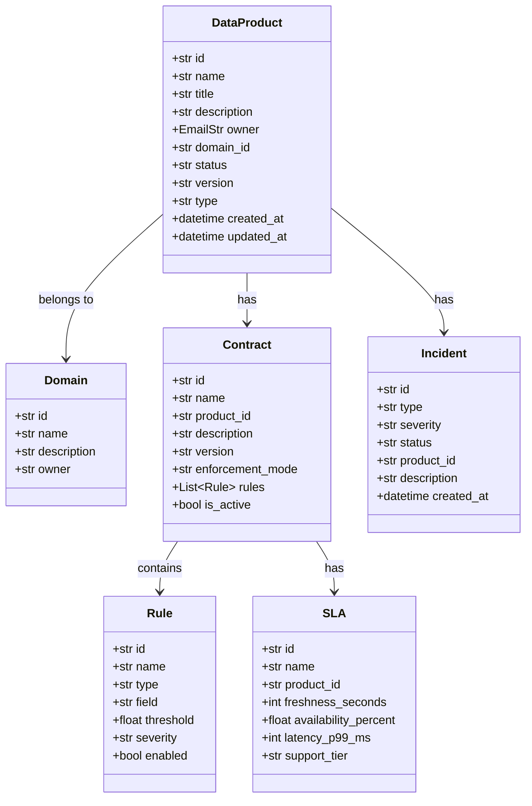

### 6.2 DataProduct Model

```python
from pydantic import BaseModel, EmailStr, Field
from datetime import datetime, UTC
from typing import List, Optional

class DataProduct(BaseModel):
    id: str                           # Unique identifier (e.g., DP001)
    name: str                         # Human-readable name
    title: str                        # Display title
    description: str = ""             # Description
    owner: EmailStr                   # Owner email
    domain_id: str                    # FK to Domain
    status: str = 'active'            # draft|active|deprecated|retired
    version: str = '1.0.0'            # Semantic version
    type: str = 'master'              # master|event|state|derived

    # Semantic search embedding
    embedding: Optional[List[float]] = None

    # Links
    documentation_url: Optional[str] = None
    source_code_url: Optional[str] = None

    created_at: datetime = Field(default_factory=lambda: datetime.now(UTC))
    updated_at: datetime = Field(default_factory=lambda: datetime.now(UTC))
```

### 6.3 Contract Model

```python
class Rule(BaseModel):
    id: str
    name: str
    type: str          # null_rate|uniqueness|range|pattern|freshness|enum
    field: Optional[str] = None
    threshold: Optional[float] = None
    min_value: Optional[float] = None
    max_value: Optional[float] = None
    pattern: Optional[str] = None
    max_age_seconds: Optional[int] = None
    allowed_values: Optional[List[str]] = None
    severity: str = 'error'   # error|warning|info
    enabled: bool = True

class Contract(BaseModel):
    id: str
    name: str
    product_id: str
    description: Optional[str] = None
    version: str = '1.0.0'
    enforcement_mode: str = 'strict'   # strict|quarantine|warn
    rules: List[Rule] = []
    is_active: bool = True
    created_at: datetime = Field(default_factory=utc_now)
```

### 6.4 SLA Model

```python
class SLA(BaseModel):
    id: str
    name: str
    product_id: str
    freshness_seconds: int      # Max age of data
    availability_percent: float  # Uptime target (e.g., 99.9)
    latency_p99_ms: int         # 99th percentile latency
    support_tier: str = 'gold'  # gold|silver|bronze
```

### 6.5 Incident Model

```python
class Incident(BaseModel):
    id: str
    type: str                    # data_quality|schema_drift|sla_breach
    severity: str                # critical|high|medium|low
    status: str                  # open|investigating|resolved|closed
    product_id: str
    description: str
    root_cause: Optional[str] = None
    resolution: Optional[str] = None
    created_at: datetime = Field(default_factory=utc_now)
    resolved_at: Optional[datetime] = None
```

---

## 7. Neo4j Graph Database

### 7.1 Graph Schema

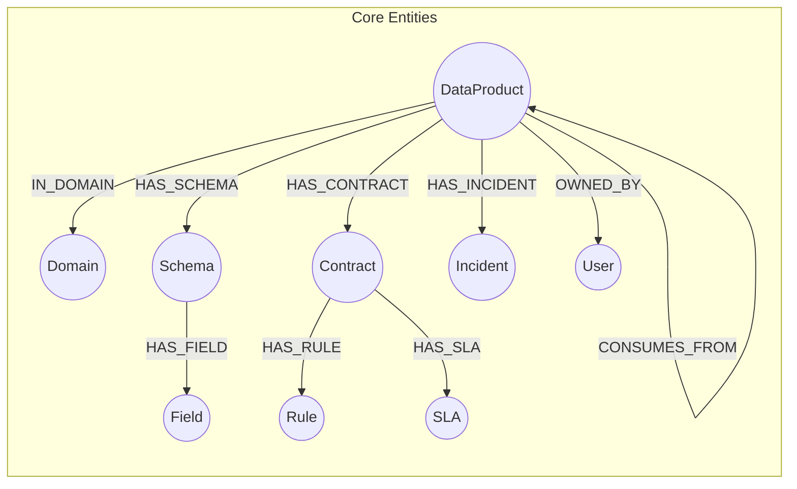

### 7.2 Neo4j Manager

```python
# src/graph/manager.py

class Neo4jManager:
    """Neo4j database manager with connection pooling and resilience."""

    _instance: Optional['Neo4jManager'] = None
    _lock = threading.Lock()
    _driver = None

    def __new__(cls):
        """Singleton pattern for connection pooling."""
        if cls._instance is None:
            with cls._lock:
                if cls._instance is None:
                    cls._instance = super().__new__(cls)
                    cls._instance._initialize()
        return cls._instance

    def _initialize(self):
        """Initialize the database connection."""
        self._driver = GraphDatabase.driver(
            settings.neo4j_uri,
            auth=(settings.neo4j_username, settings.neo4j_password),
            max_connection_pool_size=50,
            connection_timeout=30
        )

    @retry(max_attempts=3, initial_delay=0.5)
    def execute_query(self, query: str, parameters: dict = None) -> List[Dict]:
        """Execute a Cypher query with retry logic."""
        return neo4j_circuit.call(self._execute_query_internal, query, parameters)

    def _execute_query_internal(self, query: str, parameters: dict = None):
        """Internal query execution."""
        if self._is_write_query(query):
            with self.driver.session() as session:
                return session.execute_write(
                    lambda tx: [dict(r) for r in tx.run(query, parameters)]
                )
        else:
            with self.driver.session() as session:
                return session.execute_read(
                    lambda tx: [dict(r) for r in tx.run(query, parameters)]
                )
```

### 7.3 Schema Initialization

```python
def init_schema(self):
    """Initialize database schema with constraints and indexes."""
    queries = [
        # Constraints (uniqueness)
        "CREATE CONSTRAINT domain_id IF NOT EXISTS FOR (d:Domain) REQUIRE d.id IS UNIQUE",
        "CREATE CONSTRAINT product_id IF NOT EXISTS FOR (p:DataProduct) REQUIRE p.id IS UNIQUE",
        "CREATE CONSTRAINT schema_id IF NOT EXISTS FOR (s:Schema) REQUIRE s.id IS UNIQUE",
        "CREATE CONSTRAINT contract_id IF NOT EXISTS FOR (c:Contract) REQUIRE c.id IS UNIQUE",
        "CREATE CONSTRAINT incident_id IF NOT EXISTS FOR (i:Incident) REQUIRE i.id IS UNIQUE",

        # Indexes for common queries
        "CREATE INDEX product_name IF NOT EXISTS FOR (p:DataProduct) ON (p.name)",
        "CREATE INDEX product_status IF NOT EXISTS FOR (p:DataProduct) ON (p.status)",
        "CREATE INDEX incident_status IF NOT EXISTS FOR (i:Incident) ON (i.status)",
        "CREATE INDEX incident_severity IF NOT EXISTS FOR (i:Incident) ON (i.severity)",
        "CREATE INDEX contract_active IF NOT EXISTS FOR (c:Contract) ON (c.is_active)"
    ]

    for q in queries:
        try:
            self.execute_query(q)
        except Exception:
            pass  # May already exist
```

### 7.4 Common Cypher Queries

#### Get Product with Domain

```cypher
MATCH (p:DataProduct {id: $id})
OPTIONAL MATCH (p)-[:IN_DOMAIN]->(d:Domain)
RETURN p {.*, domain_name: d.name} as product
```

#### Get Downstream Products (Lineage)

```cypher
MATCH (p:DataProduct {id: $id})
MATCH (downstream:DataProduct)-[:CONSUMES_FROM*1..3]->(p)
RETURN DISTINCT downstream {.*} as product,
       length(shortestPath((downstream)-[:CONSUMES_FROM*]->(p))) as distance
ORDER BY distance
```

#### Get Dashboard Stats

```cypher
MATCH (p:DataProduct)
OPTIONAL MATCH (p)-[:HAS_INCIDENT]->(i:Incident {status: 'open'})
WITH p, count(i) as incidents
RETURN
    count(p) as total_products,
    count(CASE WHEN incidents = 0 THEN 1 END) as healthy,
    count(CASE WHEN incidents > 0 THEN 1 END) as degraded,
    avg(CASE WHEN incidents = 0 THEN 100 ELSE 50 END) as avg_health
```

#### Create Incident

```cypher
MATCH (p:DataProduct {id: $product_id})
MERGE (i:Incident {id: $id})
SET i += $props
MERGE (p)-[:HAS_INCIDENT]->(i)
RETURN i
```

---

## 8. Data Contracts & SLAs

### 8.1 Contract Validation System

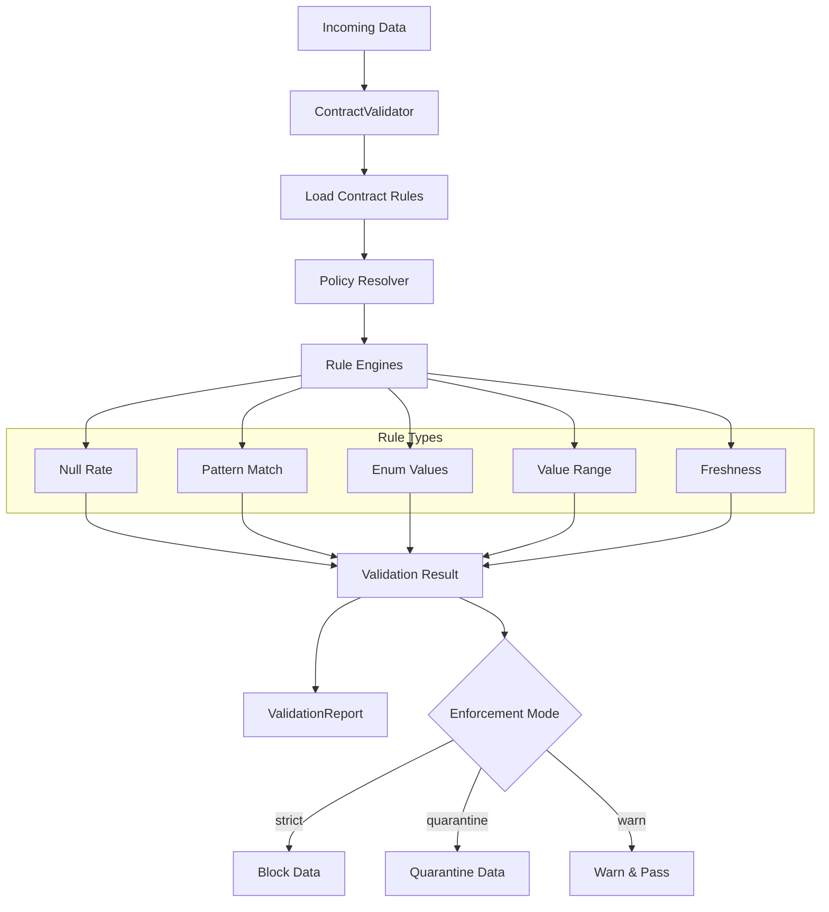

### 8.2 Contract Validator

```python
# src/contracts/validator.py

class ContractValidator:
    def __init__(self, product_id: str):
        self.product_id = product_id
        self.manager = Neo4jManager()
        self.rules = self._load_rules()

    def _load_rules(self):
        """Load contract rules with policy overrides."""
        query = """
        MATCH (p:DataProduct {id: $id})-[:HAS_CONTRACT]->(c:Contract)
        WHERE c.is_active = true
        MATCH (c)-[:HAS_RULE]->(r:Rule)
        WHERE r.enabled = true
        RETURN r
        """
        results = self.manager.execute_query(query, {"id": self.product_id})
        base_rules = [dict(r["r"]) for r in results]

        # Apply policy overrides
        resolver = PolicyResolver()
        return resolver.resolve_policies(self.product_id, base_rules)

    def validate_batch(self, data_batch: List[Dict]) -> Dict:
        """Validate a batch of records against contract rules."""
        violations = []
        invalid_rows = set()

        # Get rule engines
        engines = [get_rule_engine(r["type"], r) for r in self.rules]

        # Batch-level validations
        for engine in engines:
            if hasattr(engine, "validate_batch"):
                if not engine.validate_batch(data_batch):
                    violations.append({
                        "rule_id": engine.config["id"],
                        "field": engine.field,
                        "severity": engine.severity,
                        "message": engine.get_error_message()
                    })

        # Row-level validations
        for idx, row in enumerate(data_batch):
            for engine in engines:
                if not engine.validate(row):
                    invalid_rows.add(idx)
                    violations.append({
                        "rule_id": engine.config["id"],
                        "field": engine.field,
                        "severity": engine.severity,
                        "message": engine.get_error_message(),
                        "row": idx
                    })

        # Determine enforcement action
        result = "failed" if violations else "passed"
        action = self._determine_enforcement(result)

        return {
            "result": result,
            "action": action,
            "valid_count": len(data_batch) - len(invalid_rows),
            "invalid_count": len(invalid_rows),
            "violations": violations
        }

    def _determine_enforcement(self, result: str) -> str:
        """Determine action based on enforcement mode."""
        if result == "passed":
            return "passed"

        # Get contract enforcement mode
        query = """
        MATCH (p:DataProduct {id: $id})-[:HAS_CONTRACT]->(c:Contract)
        WHERE c.is_active = true
        RETURN c.enforcement_mode AS mode
        """
        res = self.manager.execute_query(query, {"id": self.product_id})
        mode = res[0]["mode"] if res else "warn"

        return {
            "strict": "blocked",
            "quarantine": "quarantined"
        }.get(mode, "warned")
```

### 8.3 Rule Engines

#### Base Rule Engine

```python
# src/contracts/rules/base.py

from abc import ABC, abstractmethod

class RuleEngine(ABC):
    def __init__(self, rule_config: Dict[str, Any]):
        self.config = rule_config
        self.field = rule_config.get('field')
        self.severity = rule_config.get('severity', 'error')

    @abstractmethod
    def validate(self, data: Dict[str, Any]) -> bool:
        """Returns True if valid, False if invalid."""
        pass

    @abstractmethod
    def get_error_message(self) -> str:
        pass
```

#### Null Rate Rule

```python
# src/contracts/rules/null_rate.py

class NullRateRule(RuleEngine):
    """Validates that null rate is below threshold."""

    def validate_batch(self, data_batch: List[Dict]) -> bool:
        if not data_batch or not self.field:
            return True

        threshold = self.config.get('threshold', 0.05)  # 5% default
        null_count = sum(
            1 for row in data_batch
            if row.get(self.field) is None or row.get(self.field) == ''
        )
        null_rate = null_count / len(data_batch)

        return null_rate <= threshold

    def validate(self, data: Dict) -> bool:
        # For single record, just check if null
        return data.get(self.field) is not None

    def get_error_message(self) -> str:
        threshold = self.config.get('threshold', 0.05)
        return f"Null rate for '{self.field}' exceeds {threshold*100}%"
```

#### Pattern Rule

```python
# src/contracts/rules/pattern.py

import re

class PatternRule(RuleEngine):
    """Validates that field matches a regex pattern."""

    def __init__(self, rule_config: Dict):
        super().__init__(rule_config)
        self.pattern = re.compile(rule_config.get('pattern', '.*'))

    def validate(self, data: Dict) -> bool:
        value = data.get(self.field)
        if value is None:
            return True  # Let null_rate handle nulls
        return bool(self.pattern.match(str(value)))

    def get_error_message(self) -> str:
        return f"Field '{self.field}' does not match pattern '{self.config.get('pattern')}'"
```

#### Enum Rule

```python
# src/contracts/rules/enum.py

class EnumRule(RuleEngine):
    """Validates that field value is in allowed list."""

    def validate(self, data: Dict) -> bool:
        value = data.get(self.field)
        if value is None:
            return True
        allowed = self.config.get('allowed_values', [])
        return value in allowed

    def get_error_message(self) -> str:
        allowed = self.config.get('allowed_values', [])
        return f"Field '{self.field}' must be one of: {allowed}"
```

### 8.4 SLA Monitoring

```python
# SLA definition example
{
    "id": "SLA001",
    "name": "Customer Data SLA",
    "product_id": "DP001",
    "freshness_seconds": 3600,        # Data must be < 1 hour old
    "availability_percent": 99.9,     # 99.9% uptime
    "latency_p99_ms": 100,            # 99th percentile < 100ms
    "support_tier": "gold"            # Gold tier support
}

# SLA compliance check
def check_sla_compliance(sla: dict, metrics: dict) -> dict:
    """Check if current metrics meet SLA requirements."""
    violations = []

    # Check freshness
    if metrics.get('freshness_seconds', 0) > sla['freshness_seconds']:
        violations.append({
            "metric": "freshness",
            "target": sla['freshness_seconds'],
            "actual": metrics['freshness_seconds']
        })

    # Check availability
    if metrics.get('availability_percent', 100) < sla['availability_percent']:
        violations.append({
            "metric": "availability",
            "target": sla['availability_percent'],
            "actual": metrics['availability_percent']
        })

    # Check latency
    if metrics.get('latency_p99_ms', 0) > sla['latency_p99_ms']:
        violations.append({
            "metric": "latency",
            "target": sla['latency_p99_ms'],
            "actual": metrics['latency_p99_ms']
        })

    return {
        "compliant": len(violations) == 0,
        "violations": violations
    }
```

---

## 9. API Reference

### 9.1 API Overview

Base URL: `http://localhost:8000/api`

| Category | Prefix | Description |
|----------|--------|-------------|
| Authentication | `/auth` | JWT token management |
| Products | `/products` | Data product CRUD |
| Domains | `/domains` | Domain management |
| Contracts | `/contracts` | Contract management |
| Incidents | `/incidents` | Incident handling |
| Lineage | `/lineage` | Lineage tracking |
| Agents | `/agents` | AI agent invocation |
| Intelligence | `/intelligence` | Graph RAG queries |
| SLAs | `/slas` | SLA monitoring |
| Policies | `/policies` | Policy management |

### 9.2 Products API

#### List Products

```http
GET /api/products
```

Query Parameters:
- `domain_id` (optional): Filter by domain
- `status` (optional): Filter by status
- `skip` (default: 0): Pagination offset
- `limit` (default: 50): Page size

Response:
```json
{
  "products": [
    {
      "id": "DP001",
      "name": "Customer Master",
      "domain": "Customer",
      "status": "active",
      "type": "master",
      "owner": "data-team@company.com"
    }
  ],
  "total": 15
}
```

#### Get Product Detail

```http
GET /api/products/{product_id}
```

Response:
```json
{
  "id": "DP001",
  "name": "Customer Master",
  "description": "Master customer data",
  "domain": "Customer",
  "status": "active",
  "owner": "data-team@company.com",
  "contracts": 2,
  "open_incidents": 0,
  "health": "healthy"
}
```

#### Get Product Lineage

```http
GET /api/products/{product_id}/lineage?depth=3
```

Response:
```json
{
  "product_id": "DP001",
  "upstream": [
    {"id": "RAW001", "name": "Raw Customer Data", "distance": 1}
  ],
  "downstream": [
    {"id": "DP002", "name": "Customer Analytics", "distance": 1},
    {"id": "DP003", "name": "Marketing Segments", "distance": 2}
  ]
}
```

### 9.3 Agents API

#### Run Healing Agent

```http
POST /api/agents/healing
Content-Type: application/json

{
  "incident_id": "INC001",
  "severity": "high"
}
```

Response:
```json
{
  "incident_id": "INC001",
  "action": "auto_heal",
  "recommendation": "Fallback source activated. Root cause: Data pipeline timeout.",
  "root_cause": "Upstream data source timeout",
  "root_cause_confidence": "high",
  "assessed_severity": "high",
  "remediation_steps": [
    "Activate fallback data source",
    "Monitor downstream products",
    "Investigate pipeline latency"
  ],
  "requires_approval": false,
  "status": "healed"
}
```

#### Run SLA Monitor

```http
POST /api/agents/sla-monitor
Content-Type: application/json

{
  "product_ids": ["DP001", "DP002"]
}
```

Response:
```json
{
  "status": "completed",
  "summary": {
    "total_slas": 5,
    "breached": 1,
    "at_risk": 2,
    "healthy": 2
  },
  "breached_slas": [
    {
      "sla_id": "SLA001",
      "sla_name": "Customer Data Freshness",
      "current_value": 7200,
      "target_value": 3600
    }
  ],
  "recommendations": [
    "Customer Data Freshness: Investigate pipeline delay"
  ]
}
```

#### Run Insights Agent

```http
POST /api/agents/insights
Content-Type: application/json

{
  "time_range_days": 30
}
```

Response:
```json
{
  "status": "completed",
  "executive_summary": "Data governance health is GOOD. 85% compliance rate with 2 open incidents.",
  "key_findings": [
    "15 data products monitored",
    "2 open incidents (0 critical)",
    "Contract compliance at 85%"
  ],
  "recommendations": [
    "Add contracts to 3 unprotected products",
    "Review Customer data product health"
  ],
  "risk_areas": [
    {"area": "Unprotected Products", "reason": "3 products lack contracts"}
  ],
  "alerts": []
}
```

### 9.4 Incidents API

#### Create Incident

```http
POST /api/incidents
Content-Type: application/json

{
  "product_id": "DP001",
  "type": "data_quality",
  "severity": "high",
  "description": "Null rate exceeds threshold in customer_email field"
}
```

#### Handle Incident

```http
POST /api/incidents/{incident_id}/handle?severity=high
```

### 9.5 Data Ingestion API

#### Ingest CSV

```http
POST /api/ingest/csv/{product_id}?validate=true
Content-Type: multipart/form-data

file: [CSV file]
```

Response:
```json
{
  "product_id": "DP001",
  "file_name": "customers.csv",
  "records_received": 1000,
  "records_valid": 985,
  "records_invalid": 15,
  "validation_errors": [
    {
      "rule_id": "R001",
      "field": "email",
      "severity": "error",
      "message": "Field 'email' does not match pattern"
    }
  ]
}
```

---

## 10. MCP Server Integration

### 10.1 MCP Overview

The Model Context Protocol (MCP) server allows Claude Desktop and other MCP clients to interact with DPOS through natural language.

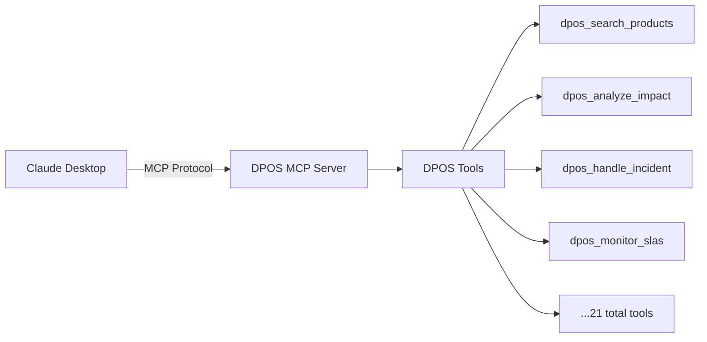

### 10.2 MCP Server Implementation

```python
# src/mcp/server.py

from mcp.server.fastmcp import FastMCP
from src.mcp.tools import get_all_tools

def create_mcp_server(name: str = "dpos-mcp"):
    """Create and configure the MCP server."""
    mcp = FastMCP(name)

    # Register all DPOS tools
    tools = get_all_tools()
    for tool in tools:
        mcp.tool()(tool)

    return mcp

class StdioMCPServer:
    """Simple MCP server for stdio communication."""

    def __init__(self):
        self.tools = {t.name: t for t in get_all_tools()}

    def handle_request(self, request: Dict) -> Dict:
        method = request.get("method")

        if method == "initialize":
            return self._handle_initialize(request["id"])
        elif method == "tools/list":
            return self._handle_list_tools(request["id"])
        elif method == "tools/call":
            return self._handle_call_tool(request["id"], request["params"])

    def _handle_call_tool(self, request_id, params):
        tool = self.tools[params["name"]]
        result = tool.invoke(params["arguments"])
        return {
            "jsonrpc": "2.0",
            "id": request_id,
            "result": {"content": [{"type": "text", "text": json.dumps(result)}]}
        }
```

### 10.3 Available MCP Tools

#### Core Data Product Tools

```python
@tool
def dpos_search_products(query: str, limit: int = 10) -> List[Dict]:
    """Search for data products in the DPOS catalog."""
    with Neo4jManager() as mgr:
        cypher = """
        MATCH (p:DataProduct)
        WHERE toLower(p.name) CONTAINS toLower($query)
           OR toLower(p.description) CONTAINS toLower($query)
        RETURN p.id, p.name, p.description, p.status
        LIMIT $limit
        """
        return mgr.execute_query(cypher, {"query": query, "limit": limit})

@tool
def dpos_get_product(product_id: str) -> Dict:
    """Get detailed information about a specific data product."""
    # Implementation...

@tool
def dpos_get_lineage(product_id: str, direction: str = "both", depth: int = 3) -> Dict:
    """Get data lineage - upstream sources and downstream consumers."""
    # Implementation...

@tool
def dpos_list_incidents(status: str = "open", severity: str = None) -> List[Dict]:
    """List incidents in the DPOS system."""
    # Implementation...
```

#### AI Agent Tools

```python
@tool
def dpos_handle_incident(incident_id: str, severity: str = "medium") -> Dict:
    """Handle an incident using the AI Healing Agent."""
    runner = _get_agent_runner()
    return runner["handle_incident"](incident_id, severity)

@tool
def dpos_analyze_impact(product_id: str) -> Dict:
    """Analyze the downstream impact of a data product failure."""
    runner = _get_agent_runner()
    return runner["analyze_impact"](product_id)

@tool
def dpos_monitor_slas(product_ids: List[str] = None) -> Dict:
    """Monitor SLA compliance and detect breaches."""
    from src.agents.sla_agent import run_sla_monitoring
    return run_sla_monitoring(product_ids)

@tool
def dpos_generate_insights(time_range_days: int = 30) -> Dict:
    """Generate governance insights and recommendations."""
    from src.agents.insights_agent import run_insights_analysis
    return run_insights_analysis(time_range_days)
```

### 10.4 Tool Categories

| Category | Tools | Purpose |
|----------|-------|---------|
| **Data Products** | search, get, lineage, dashboard | Query product catalog |
| **Agents** | healing, steward, impact, sla, insights | AI-powered analysis |
| **Governance** | contracts, rules, slas | View governance config |
| **Advanced** | cypher, extract | Power user features |

### 10.5 Claude Desktop Configuration

Add to Claude Desktop config:

```json
{
  "mcpServers": {
    "dpos": {
      "command": "python",
      "args": ["-m", "src.mcp.server"],
      "cwd": "/path/to/dpos-ecommerce"
    }
  }
}
```

---

## 11. Frontend Architecture

### 11.1 Project Structure

```
frontend/
├── public/                  # Static assets
├── src/
│   ├── api/
│   │   └── client.js       # Axios API client
│   ├── components/
│   │   ├── DataTable.jsx   # Reusable data table
│   │   ├── Layout.jsx      # Main layout
│   │   └── StatCard.jsx    # Statistics card
│   ├── pages/
│   │   ├── Dashboard.jsx   # Main dashboard
│   │   ├── Products.jsx    # Product catalog
│   │   ├── Agents.jsx      # AI agents
│   │   ├── Contracts.jsx   # Contract management
│   │   ├── Incidents.jsx   # Incident tracking
│   │   ├── Lineage.jsx     # Lineage visualization
│   │   └── ...            # 15 total pages
│   ├── App.jsx             # Root component
│   ├── main.jsx            # Entry point
│   └── index.css           # Global styles
├── index.html
├── vite.config.js
├── tailwind.config.js
└── package.json
```

### 11.2 Routing Configuration

```jsx
// src/App.jsx
import { BrowserRouter, Routes, Route } from 'react-router-dom'
import Layout from './components/Layout'
import Dashboard from './pages/Dashboard'
import Products from './pages/Products'
import Agents from './pages/Agents'
// ... other imports

function App() {
  return (
    <BrowserRouter>
      <Routes>
        <Route path="/" element={<Layout />}>
          <Route index element={<Dashboard />} />
          <Route path="products" element={<Products />} />
          <Route path="products/:id" element={<ProductDetail />} />
          <Route path="domains" element={<Domains />} />
          <Route path="contracts" element={<Contracts />} />
          <Route path="incidents" element={<Incidents />} />
          <Route path="lineage" element={<Lineage />} />
          <Route path="pipelines" element={<Pipelines />} />
          <Route path="policies" element={<Policies />} />
          <Route path="marketplace" element={<Marketplace />} />
          <Route path="agents" element={<Agents />} />
          <Route path="intelligence" element={<Intelligence />} />
          <Route path="ingestion" element={<Ingestion />} />
          <Route path="human-review" element={<HumanReview />} />
        </Route>
      </Routes>
    </BrowserRouter>
  )
}
```

### 11.3 API Client

```javascript
// src/api/client.js
import axios from 'axios'

const api = axios.create({
  baseURL: '/api',
  headers: { 'Content-Type': 'application/json' }
})

// Dashboard
export const getDashboardStats = () =>
  api.get('/dashboard/stats').then(r => r.data)

// Products
export const getProducts = (params = {}) =>
  api.get('/products', { params }).then(r => r.data)
export const getProduct = (id) =>
  api.get(`/products/${id}`).then(r => r.data)
export const getProductLineage = (id, depth = 3) =>
  api.get(`/products/${id}/lineage`, { params: { depth } }).then(r => r.data)

// Agents
export const runHealingAgent = (incidentId, severity) =>
  api.post('/agents/healing', { incident_id: incidentId, severity }).then(r => r.data)
export const runInsightsAgent = (timeRangeDays = 30) =>
  api.post('/agents/insights', { time_range_days: timeRangeDays }).then(r => r.data)

// Streaming Agents (SSE)
export const streamHealingAgent = (incidentId, severity, onMessage) => {
  const eventSource = new EventSource(
    `/api/agents/healing/stream?incident_id=${incidentId}&severity=${severity}`
  )
  eventSource.onmessage = (event) => {
    const data = JSON.parse(event.data)
    onMessage(data)
    if (data.status === 'completed' || data.status === 'error') {
      eventSource.close()
    }
  }
  return eventSource
}

// Data Ingestion
export const ingestCSV = (productId, file, validate = true) => {
  const formData = new FormData()
  formData.append('file', file)
  return api.post(`/ingest/csv/${productId}?validate=${validate}`, formData, {
    headers: { 'Content-Type': 'multipart/form-data' }
  }).then(r => r.data)
}
```

### 11.4 Dashboard Component

```jsx
// src/pages/Dashboard.jsx
import { useQuery } from '@tanstack/react-query'
import { getDashboardStats, getHealthByDomain } from '../api/client'
import StatCard from '../components/StatCard'
import { Database, FileCheck, AlertTriangle } from 'lucide-react'

export default function Dashboard() {
  const { data: stats, isLoading } = useQuery({
    queryKey: ['dashboardStats'],
    queryFn: getDashboardStats,
    refetchInterval: 30000  // Refresh every 30s
  })

  const { data: healthByDomain } = useQuery({
    queryKey: ['healthByDomain'],
    queryFn: getHealthByDomain,
    refetchInterval: 60000
  })

  if (isLoading) return <LoadingSpinner />

  return (
    <div className="space-y-6">
      <h1 className="text-2xl font-bold">Dashboard</h1>

      {/* Main Stats */}
      <div className="grid grid-cols-4 gap-6">
        <StatCard
          title="Total Products"
          value={stats?.total_products || 0}
          icon={Database}
          color="primary"
        />
        <StatCard
          title="Active Contracts"
          value={stats?.active_contracts || 0}
          icon={FileCheck}
          color="green"
        />
        <StatCard
          title="Open Incidents"
          value={stats?.open_incidents || 0}
          icon={AlertTriangle}
          color={stats?.open_incidents > 0 ? 'red' : 'green'}
        />
      </div>

      {/* Health Score */}
      <div className="card">
        <h3>Overall Health Score</h3>
        <div className="text-5xl font-bold">
          {stats?.avg_health_score}%
        </div>
        <div className="w-full bg-gray-200 rounded-full h-3">
          <div
            className="bg-green-500 h-3 rounded-full"
            style={{ width: `${stats?.avg_health_score}%` }}
          />
        </div>
      </div>

      {/* Domain Health */}
      <div className="card">
        <h3>Health by Domain</h3>
        {healthByDomain?.map(domain => (
          <div key={domain.id} className="flex justify-between p-3">
            <span>{domain.name}</span>
            <span className={domain.health === 'healthy' ? 'text-green-600' : 'text-red-600'}>
              {domain.health}
            </span>
          </div>
        ))}
      </div>
    </div>
  )
}
```

### 11.5 Page Descriptions

| Page | Description |
|------|-------------|
| **Dashboard** | Overview with stats, health score, domain health |
| **Products** | Data product catalog with search and filters |
| **ProductDetail** | Individual product view with lineage and metrics |
| **Domains** | Organizational domain management |
| **Contracts** | Data contract definitions and rules |
| **Incidents** | Incident tracking and management |
| **Lineage** | Data lineage visualization |
| **Pipelines** | Data pipeline management |
| **Policies** | Governance policy management |
| **Marketplace** | Data product discovery |
| **Agents** | AI agent execution interface |
| **Intelligence** | Graph RAG and insights |
| **Ingestion** | Data import interface |
| **HumanReview** | Human-in-the-loop approvals |

---

## 12. Configuration & Environment

### 12.1 Environment Variables

```bash
# .env file

# Environment
ENVIRONMENT=development
DEBUG=false

# Neo4j Database
NEO4J_URI=bolt://localhost:7687
NEO4J_USERNAME=neo4j
NEO4J_PASSWORD=your-secure-password
NEO4J_DATABASE=neo4j
NEO4J_MAX_CONNECTION_POOL_SIZE=50
NEO4J_CONNECTION_TIMEOUT=30

# LLM - Ollama (default)
OLLAMA_BASE_URL=http://localhost:11434
OLLAMA_MODEL=llama3

# LLM - OpenAI (alternative)
OPENAI_API_KEY=sk-...
OPENAI_MODEL=gpt-4

# LLM - Anthropic (alternative)
ANTHROPIC_API_KEY=sk-ant-...
ANTHROPIC_MODEL=claude-3-opus-20240229

# JWT Authentication
JWT_SECRET_KEY=your-secret-key-use-openssl-rand-hex-32
JWT_ALGORITHM=HS256
JWT_ACCESS_TOKEN_EXPIRE_MINUTES=30

# Rate Limiting
RATE_LIMIT_REQUESTS_PER_MINUTE=100
RATE_LIMIT_BURST=20

# CORS
CORS_ALLOWED_ORIGINS=http://localhost:3000,http://localhost:5173

# File Upload
MAX_UPLOAD_SIZE_MB=50

# Kafka (optional)
KAFKA_BOOTSTRAP_SERVERS=localhost:9092

# Logging
LOG_LEVEL=INFO

# Observability
OTEL_EXPORTER_OTLP_ENDPOINT=http://localhost:4317
METRICS_PORT=9090
```

### 12.2 Configuration Class

```python
# src/core/config.py

from pydantic_settings import BaseSettings
from pydantic import Field

class Settings(BaseSettings):
    """Application settings with validation."""

    # Environment
    environment: str = Field(default="development")
    debug: bool = Field(default=False)

    # Neo4j
    neo4j_uri: str = Field(default="bolt://localhost:7687")
    neo4j_username: str = Field(default="neo4j")
    neo4j_password: str = Field(default="")
    neo4j_database: str = Field(default="neo4j")
    neo4j_max_connection_pool_size: int = Field(default=50)

    # LLM Providers
    ollama_base_url: str = Field(default="http://localhost:11434")
    ollama_model: str = Field(default="llama3")
    openai_api_key: Optional[str] = Field(default=None)
    anthropic_api_key: Optional[str] = Field(default=None)

    # JWT
    jwt_secret_key: str = Field(default="CHANGE_IN_PRODUCTION")
    jwt_algorithm: str = Field(default="HS256")

    # Rate Limiting
    rate_limit_requests_per_minute: int = Field(default=100)
    rate_limit_burst: int = Field(default=20)

    @property
    def cors_origins_list(self) -> List[str]:
        return self.cors_allowed_origins.split(",")

    @property
    def is_production(self) -> bool:
        return self.environment == "production"

    class Config:
        env_file = ".env"

settings = Settings()
```

---

## 13. Testing Strategy

### 13.1 Test Structure

```
tests/
├── conftest.py                 # Shared fixtures
├── test_models/
│   └── test_models.py         # Pydantic model tests
├── test_contracts/
│   ├── test_validator.py      # Contract validator tests
│   └── test_rules.py          # Individual rule tests
├── test_agents/
│   ├── test_healing_agent.py  # Healing agent tests
│   ├── test_sla_agent.py      # SLA agent tests
│   └── test_insights_agent.py # Insights agent tests
├── test_api/
│   ├── test_products.py       # Product endpoint tests
│   ├── test_domains.py        # Domain endpoint tests
│   └── test_incidents.py      # Incident endpoint tests
└── e2e/
    └── test_full_flow.py      # End-to-end tests
```

### 13.2 pytest Configuration

```ini
# pytest.ini
[pytest]
testpaths = tests
python_files = test_*.py
python_functions = test_*
markers =
    integration: marks tests as integration tests (require Neo4j)
    slow: marks tests as slow (deselect with '-m "not slow"')
    neo4j: marks tests requiring Neo4j connection
asyncio_mode = auto
```

### 13.3 Test Fixtures

```python
# tests/conftest.py

import pytest
from unittest.mock import MagicMock, patch

@pytest.fixture
def mock_neo4j():
    """Mock Neo4j manager for unit tests."""
    with patch('src.graph.manager.Neo4jManager') as mock:
        instance = MagicMock()
        mock.return_value.__enter__ = MagicMock(return_value=instance)
        mock.return_value.__exit__ = MagicMock(return_value=False)
        yield instance

@pytest.fixture
def sample_product():
    """Sample data product for testing."""
    return {
        "id": "DP001",
        "name": "Test Product",
        "domain_id": "DOM001",
        "owner": "test@example.com",
        "status": "active"
    }

@pytest.fixture
def sample_contract():
    """Sample contract for testing."""
    return {
        "id": "C001",
        "name": "Test Contract",
        "product_id": "DP001",
        "enforcement_mode": "strict",
        "rules": [
            {
                "id": "R001",
                "type": "null_rate",
                "field": "email",
                "threshold": 0.05
            }
        ]
    }
```

### 13.4 Example Tests

```python
# tests/test_contracts/test_validator.py

def test_validate_batch_passes_valid_data(mock_neo4j):
    """Test that valid data passes validation."""
    mock_neo4j.execute_query.return_value = [
        {"r": {"id": "R001", "type": "null_rate", "field": "email", "threshold": 0.05}}
    ]

    validator = ContractValidator("DP001")
    result = validator.validate_batch([
        {"email": "test@example.com"},
        {"email": "user@company.com"}
    ])

    assert result["result"] == "passed"
    assert result["valid_count"] == 2
    assert result["invalid_count"] == 0

def test_validate_batch_fails_with_nulls(mock_neo4j):
    """Test that null rate violation is detected."""
    mock_neo4j.execute_query.return_value = [
        {"r": {"id": "R001", "type": "null_rate", "field": "email", "threshold": 0.05}}
    ]

    # 50% null rate (exceeds 5% threshold)
    validator = ContractValidator("DP001")
    result = validator.validate_batch([
        {"email": None},
        {"email": "user@company.com"}
    ])

    assert result["result"] == "failed"
    assert len(result["violations"]) > 0


# tests/test_agents/test_healing_agent.py

def test_healing_agent_routes_critical_to_escalate(mock_neo4j):
    """Test that critical severity routes to escalation."""
    from src.agents.healing_agent import build_healing_agent

    mock_neo4j.execute_query.return_value = [
        {"id": "INC001", "severity": "critical", "product_id": "DP001"}
    ]

    agent = build_healing_agent()
    result = agent.invoke({
        "incident_id": "INC001",
        "severity": "critical",
        "messages": []
    })

    assert result["action"] == "escalate_to_human"
    assert result["requires_approval"] == True
```

### 13.5 Running Tests

```bash
# Run all tests
pytest

# Run with coverage
pytest --cov=src tests/

# Run specific category
pytest tests/test_agents/ -v

# Skip integration tests
pytest -m "not integration"

# Run only fast tests
pytest -m "not slow"
```

---

## 14. Deployment Guide

### 14.1 Prerequisites

- Python 3.11+
- Node.js 18+
- Neo4j 5.x
- Docker (optional)
- Ollama (for local LLM)

### 14.2 Development Setup

```bash
# Clone repository
git clone <repository-url>
cd dpos-ecommerce

# Backend setup
python -m venv .venv
source .venv/bin/activate  # Windows: .venv\Scripts\activate
pip install -r requirements.txt

# Frontend setup
cd frontend
npm install

# Configure environment
cp .env.example .env
# Edit .env with your settings

# Start Neo4j (Docker)
docker run -d \
  --name neo4j \
  -p 7474:7474 -p 7687:7687 \
  -e NEO4J_AUTH=neo4j/password \
  neo4j:5

# Start Ollama (for LLM)
ollama serve
ollama pull llama3

# Start backend
python -m uvicorn src.api.main:app --reload --port 8000

# Start frontend (separate terminal)
cd frontend
npm run dev
```

### 14.3 Docker Deployment

```dockerfile
# Dockerfile
FROM python:3.11-slim as builder

WORKDIR /app
COPY requirements.txt .
RUN pip install --no-cache-dir -r requirements.txt

FROM python:3.11-slim as production

WORKDIR /app
COPY --from=builder /usr/local/lib/python3.11/site-packages /usr/local/lib/python3.11/site-packages
COPY src/ src/
COPY scripts/ scripts/

EXPOSE 8000

CMD ["python", "-m", "uvicorn", "src.api.main:app", "--host", "0.0.0.0", "--port", "8000"]
```

### 14.4 docker-compose.yml

```yaml
version: '3.8'

services:
  api:
    build: .
    ports:
      - "8000:8000"
    environment:
      - NEO4J_URI=bolt://neo4j:7687
      - NEO4J_PASSWORD=password
    depends_on:
      - neo4j

  frontend:
    build: ./frontend
    ports:
      - "3000:3000"
    depends_on:
      - api

  neo4j:
    image: neo4j:5
    ports:
      - "7474:7474"
      - "7687:7687"
    environment:
      - NEO4J_AUTH=neo4j/password
    volumes:
      - neo4j_data:/data

  ollama:
    image: ollama/ollama
    ports:
      - "11434:11434"
    volumes:
      - ollama_models:/root/.ollama

volumes:
  neo4j_data:
  ollama_models:
```

### 14.5 Production Checklist

- [ ] Set `ENVIRONMENT=production`
- [ ] Generate secure `JWT_SECRET_KEY`
- [ ] Configure proper `CORS_ALLOWED_ORIGINS`
- [ ] Set up SSL/TLS
- [ ] Configure rate limiting
- [ ] Set up monitoring (Prometheus/Grafana)
- [ ] Configure log aggregation
- [ ] Set up backup for Neo4j
- [ ] Configure CI/CD pipeline

---

## Appendix

### A. Quick Reference Commands

```bash
# Start all services
scripts/start_all.bat  # Windows
./scripts/start_all.sh  # Unix

# Load sample data
python scripts/load_all.py

# Run specific agent demo
python scripts/demo_healing.py
python scripts/demo_impact.py

# Start MCP server
python -m src.mcp.server

# Run tests
pytest tests/ -v

# Build frontend
cd frontend && npm run build
```

### B. API Quick Reference

| Method | Endpoint | Description |
|--------|----------|-------------|
| GET | `/api/products` | List products |
| GET | `/api/products/{id}` | Get product |
| GET | `/api/products/{id}/lineage` | Get lineage |
| POST | `/api/agents/healing` | Run healing agent |
| POST | `/api/agents/insights` | Run insights agent |
| POST | `/api/incidents` | Create incident |
| POST | `/api/ingest/csv/{id}` | Ingest CSV |
| GET | `/health` | Health check |

### C. Agent Quick Reference

| Agent | Endpoint | Input |
|-------|----------|-------|
| Discovery | `/api/agents/discovery` | `{query}` |
| Healing | `/api/agents/healing` | `{incident_id, severity}` |
| Impact | `/api/agents/impact` | `{product_id}` |
| SLA | `/api/agents/sla-monitor` | `{product_ids[]}` |
| Insights | `/api/agents/insights` | `{time_range_days}` |

---