# Building DPOS: An AI‑Powered Data Product Operating System (Deep Dive)

Modern organizations increasingly treat data as a product: a durable asset with ownership, lifecycle, contracts, and measurable reliability. The hardest part is not building a catalog; it is building the operational system around it: enforcement, incident handling, lineage-driven impact analysis, and an interface that lets humans and machines collaborate.

DPOS (Data Product Operating System) is a full-stack implementation of that idea. It combines a Neo4j knowledge graph as the “digital twin” of the data ecosystem, a FastAPI backend that exposes governance workflows, Kafka streaming enforcement for near-real-time validation, a React/Vite frontend for operators, and a family of LangGraph agents that reason over incidents, lineage, SLAs, and policies. It also exposes an MCP server so tools like Claude Desktop can interact with the platform through structured tool calls.

This post is intentionally implementation-grounded. Every section is anchored to what exists in the project: the ontology and config, the backend routes and core modules, the agent set, the enforcement pipeline, the marketplace search, the knowledge extraction and hybrid RAG components, and the deployment/testing approach.

---

## 1) What DPOS is (and what it is not)

DPOS is an operating system for data products, not just a metadata registry. It treats “catalog entries” as active entities that participate in runtime governance: they can be validated, monitored, enforced, impacted by incidents, and queried through structured and natural language interfaces.

At a conceptual level, DPOS has three simultaneous views of your ecosystem. First, it has a graph view: nodes like `DataProduct`, `Domain`, `Contract`, `Rule`, `SLA`, `Incident`, `Pipeline`, `Metric`, `User`, and ports are connected through relationships such as lineage (`CONSUMES_FROM`), governance (`HAS_CONTRACT`, `HAS_RULE`), and operations (`HAS_INCIDENT`, `HANDLED_BY`). Second, it has an enforcement view: data arrives in batches or streams, validation rules run, and an enforcement decision is executed (pass, warn, quarantine, block). Third, it has an intelligence view: agents and hybrid RAG translate questions and events into actions and narratives.

A common misunderstanding is that AI is the “core” of the platform. In DPOS, the core is the *governance model* and the *graph-backed operational state*. AI is a layer that improves decision quality, speed, and communication; when AI is unavailable, DPOS is designed to degrade gracefully to deterministic behavior.

### Example

Imagine a `Customer Master` data product (say `DP001`). Governance in DPOS does not stop at writing documentation. Instead, the product has a contract that says “email must match a pattern and null rate must stay below 5%”, an SLA that says “freshness must stay under 1 hour”, lineage connections to downstream products like `Customer Analytics`, and operational signals like incidents and metrics. When a bad batch arrives or a streaming message violates rules, the system creates an incident and can trigger an agent run.

---

## 2) End-to-end architecture: layers and responsibilities

DPOS is a layered system. The frontend is a React/Vite UI that renders dashboards and operational workflows. The backend is a FastAPI app that hosts route handlers for products, contracts, lineage, incidents, agents, ingestion, marketplace, policies, and more. The data layer is a Neo4j graph database storing the ecosystem’s state and relationships. The streaming layer uses Kafka topic conventions to enforce contracts as records arrive. The AI layer integrates a unified LLM interface supporting Ollama by default with optional OpenAI/Anthropic fallbacks. The integration layer includes an MCP server exposing “tools” that call directly into the same DPOS capabilities.

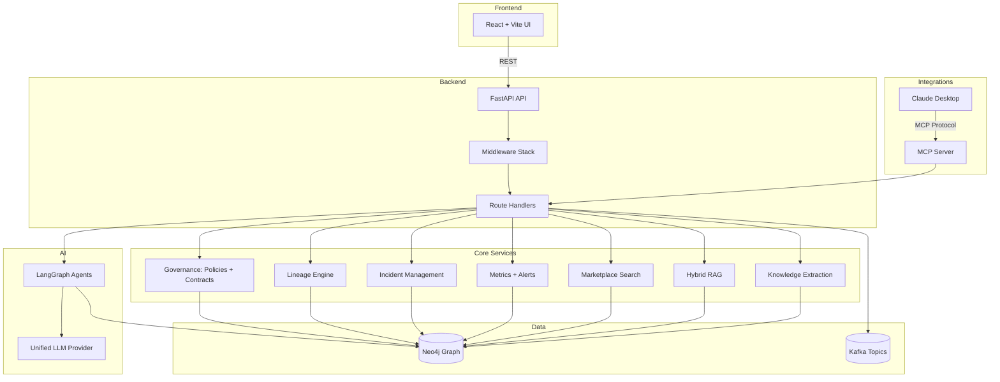

The key idea is that every operational capability uses the *same core data model*. If an agent says “this incident affects three downstream products”, it is not hallucinating a dependency list. It is traversing the lineage relationships in Neo4j and then generating a narrative around the results.

### Example

When a user reports a data issue from the UI, the backend creates an `Incident` node related to a `DataProduct`. The Healing Agent then pulls that incident, traverses lineage to compute impact, optionally consults the LLM for diagnosis text, and writes an `AgentExecution` record. That single flow touches UI, API, Neo4j, agents, and often Kafka.

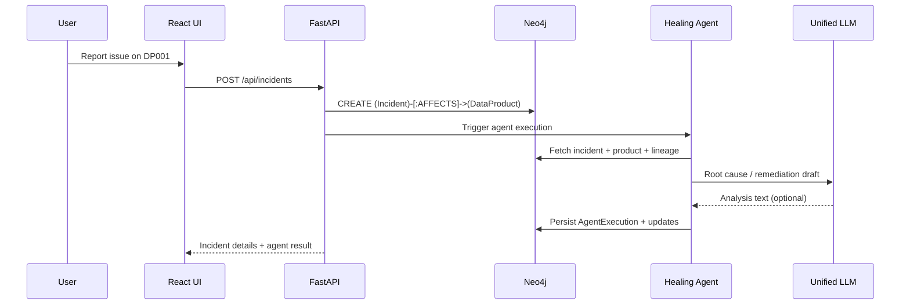

---

## 3) Technology stack and why each piece exists

DPOS uses FastAPI because governance workflows are API-first and benefit from async IO, structured validation, and automatic OpenAPI docs. Neo4j exists because lineage and impact analysis are naturally graph problems, and governance relationships are first-class connections, not “joins” to be inferred later. Kafka exists because governance has to move closer to the data plane; if you can validate and route records as they arrive, you reduce blast radius and mean time to detection.

The AI system is implemented with LangGraph so agents are explicit state machines instead of opaque “prompt scripts”. That matters for operations: you can resume executions, persist checkpoints, and route based on state and severity. A unified LLM interface exists because AI is a dependency you want to treat like a pluggable backend: local-first with Ollama, but cloud-capable.

The frontend exists because governance is not only APIs. Operators need a dashboard and a human-in-the-loop workspace where approvals and investigations are visible.

### Example

A common real-world setup starts with local Ollama embeddings for marketplace search and an on-prem Neo4j. Later, teams may swap in OpenAI or Anthropic for more nuanced incident narratives while leaving the deterministic enforcement pipeline untouched.

---

## 4) The ontology: making the knowledge graph predictable (and LLM-friendly)

The ontology is DPOS’s “contract with itself”. It defines node types (like `DataProduct`, `Contract`, `Rule`, `SLA`, `Incident`, `Pipeline`, `Metric`, `ValidationReport`, `User`, `Team`) and relationship types (like lineage via `CONSUMES_FROM`, incident handling via `HANDLED_BY`, and governance attachment via `HAS_CONTRACT` and `HAS_RULE`). The ontology is not just documentation; it is also used by knowledge extraction components so the system can map unstructured text into structured graph entities.

The practical benefit of an ontology is consistency: graph queries become stable, dashboards can rely on predictable schema, and LLM-assisted features can be constrained by known entity types and relationships.

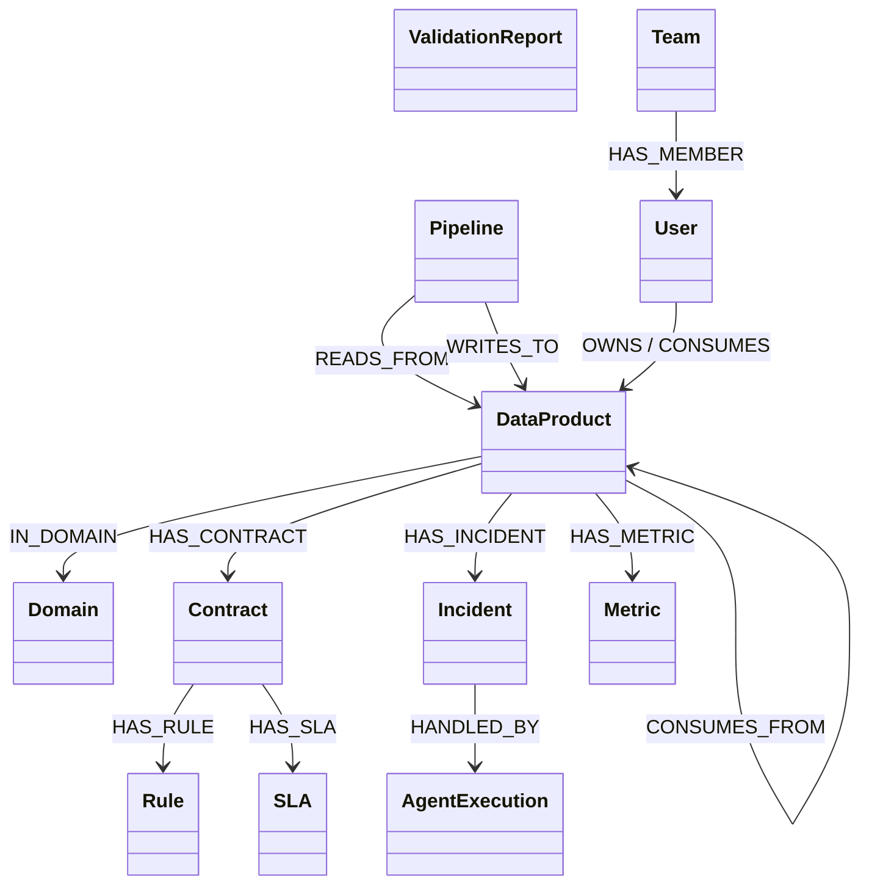

One subtle point that’s easy to miss (and you called it out correctly): `CONSUMES_FROM` is not a “node” in DPOS. It is a relationship *between two `DataProduct` nodes*. So the self-referential line `DataProduct --> DataProduct : CONSUMES_FROM` is intentional. In a lineage graph, you should read that edge as “a consumer data product depends on an upstream data product.”

If the class diagram feels visually confusing because it points “back to itself”, the following lineage-specific diagram is often clearer for humans. It explicitly shows multiple products connected by `CONSUMES_FROM` edges.

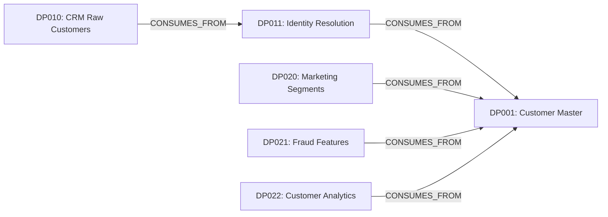

### Example

Suppose a runbook says “Marketing Segments consumes from Customer Master and must have fewer than 5% missing emails.” A free-form system might store that as text. DPOS’s ontology-guided extractor can interpret it into two `DataProduct` nodes, a `CONSUMES_FROM` edge, and a `Rule` node attached to a `Contract`—all grounded in explicit types.

---

## 5) Data products: ownership, lifecycle, and meaning

A `DataProduct` in DPOS is the unit of accountability. It is not only a dataset name; it carries ownership (email/team), status (draft/active/deprecated/archived), type (source/derived/aggregate/feature or variants), schema attachment, contract attachment, lineage connections, metrics, and incidents.

The biggest shift in a product operating system is that “being in the catalog” is not the finish line. A product becomes healthy when contracts exist, validation runs, SLA monitoring exists, and lineage is maintained so impact is visible.

### Example

Create `DP001` (Customer Master) and attach it to the `Customer` domain. Then attach schema fields, define a contract with rules for `customer_email`, and define a freshness SLA. Once it is in Neo4j, any agent or API can ask, “Who owns this, what depends on it, and what is its current health?”

---

## 6) Domains: organizing ownership and policy scope

A `Domain` groups products that share business context and ownership. Domain scoping matters because governance policies often differ by domain. For example, a domain handling PII may require stricter enforcement than a domain holding aggregated analytics.

In DPOS, domains can host domain-wide policies and become the unit of domain health summaries in dashboards.

### Example

If the `Customer` domain owns products `DP001` and `DP002`, a domain-scoped policy can override contract thresholds (for example, stricter null-rate for PII fields), and incident dashboards can present “Customer domain health” instead of forcing operators to manually aggregate signals.

---

## 7) Schemas and fields: the structural shape of products

Schemas (`Schema`) and fields (`Field`) represent the structure of a product. A field can carry attributes like type, nullability, and whether it contains PII. While DPOS can run without deep schema validation, schema becomes crucial for quality rules, for documenting semantics, and for automating knowledge extraction and governance checks.

### Example

When you mark `customer_email` as a string and PII, you can route governance policies to it. A “PII policy” can require pattern validation and stricter enforcement or approvals for exposure via an output port.

---

## 8) Contracts: enforceable producer–consumer agreements

Contracts in DPOS are the mechanism that transforms “best practices” into enforceable behavior. A `Contract` links to a `DataProduct`, contains multiple `Rule` entries, and defines an enforcement mode such as strict, warn, log/quarantine depending on the implementation and configuration.

The important architectural choice here is that rules are not hidden in code; they are stored as data. This enables a uniform validator to load rules from the graph and apply them consistently, and it enables agents to reason about rule histories and violations.

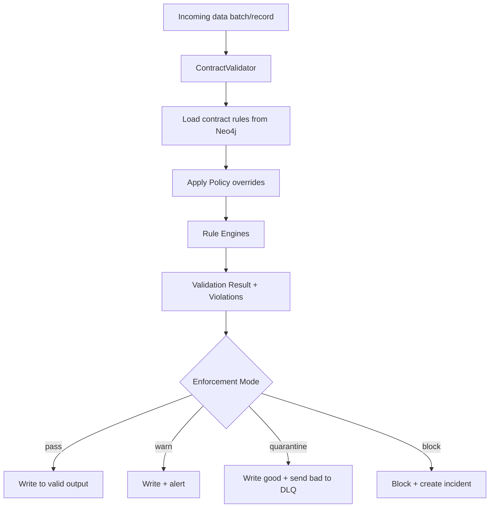

### Example

A contract for `DP001` might include a `pattern` rule for `email` and a `null_rate` rule with threshold 0.05. When a batch contains many missing emails, the validator returns `failed` and the enforcement layer can choose to quarantine or block depending on mode.

---

## 9) Rule engines: turning abstract rules into concrete checks

DPOS implements rule engines as classes that can validate either individual records or batches, depending on the rule type. The project includes rules like null-rate and pattern matching, and the ontology includes a broader set (range, uniqueness, freshness, enum, and custom). The key design is that every rule engine has a uniform interface: “validate” and “error message,” plus optional batch-level behavior.

This separation is what makes enforcement extensible. You can add new rule types without changing all ingestion code; you add a rule definition and an engine mapping.

### Example

A `null_rate` rule may be best evaluated at batch level because you need to compute an aggregate percentage. A `pattern` rule is naturally per-row because you validate one email value at a time. DPOS supports both patterns while keeping a single validator entry point.

---

## 10) SLAs: making reliability explicit (freshness, availability, latency)

SLAs describe the promises around a product: how fresh it must be, how available it should remain, and how responsive it is expected to be. DPOS includes an SLA agent that checks compliance and can predict breach risks, and the ontology defines SLA properties like freshness and availability.

An SLA is not merely a dashboard target. In DPOS it is an input to severity reassessment during incidents. A low-severity contract violation may become operationally critical if it breaks an SLA for a high-impact downstream use case.

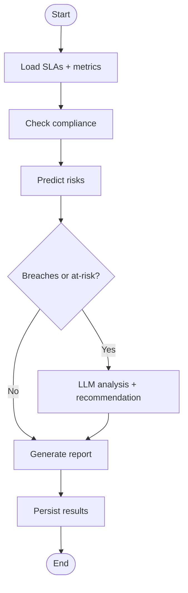

### Example

If `DP001` has freshness SLA of 3600 seconds but current metrics show 7200 seconds, the SLA agent can record a breach, recommend investigating pipeline delays, and optionally generate a narrative that can be sent to stakeholders.

---

## 11) Policies: consistent governance at global/domain/product scope

Policies are the layer that enforces consistency across contracts without forcing every team to rewrite the same rules. In DPOS, a `Policy` can be global, domain-scoped, or product-scoped, and `PolicyRule` can override thresholds or enforcement behavior.

The benefit is operational governance that adapts to context. If your organization changes a policy (for example, “PII email must be pattern-validated with strict enforcement”), DPOS can apply that across products without editing each contract by hand.

### Example

If a domain contains sensitive customer data, a domain policy might override the `null_rate` threshold from 5% down to 1% and change enforcement from warn to strict. The validator loads contract rules, then applies policy resolver overrides before executing rule engines.

---

## 12) Pipelines: operational context and fallback mechanisms

Pipelines represent the processes that produce and transform data products. In DPOS, pipelines carry operational properties like schedule, orchestrator, last run timestamps, and whether a fallback source exists. This matters because enforcement and incident handling often depend on fallback availability.

A well-designed product platform is honest about the difference between “data is bad” and “data is late.” Pipelines help distinguish these conditions and guide response strategies.

### Example

If `DP001` is produced by a streaming pipeline with a known fallback source, the Healing Agent can route `high` severity incidents to “auto-heal” by activating fallback rather than escalating immediately.

---

## 13) Input and output ports: connecting products to the data plane

Ports represent how products ingest data and how they publish it. Input ports may be databases, Kafka topics, APIs, object stores, or files; output ports similarly represent downstream publication endpoints and may require approvals or have public exposure flags.

Ports are a critical concept because governance is not only about validation; it is also about controlling exposure. A product might be healthy, but still require approval before being published to a public API or external bucket.

### Example

A product can have an output port of type `kafka` that publishes validated records to `dpos.valid.DP001`. If a product is marked as public, policies might require approvals or additional checks before that port can be activated.

---

## 14) Metrics and health: measuring reality rather than assumptions

DPOS records metrics like quality scores, null rates, freshness, row counts, query counts, and latency. Metrics power dashboards and can inform incident severity. In the codebase, there is also an observability module implementing timers, counters, histograms, and tracing spans so the platform itself can be monitored.

A useful governance platform treats “health” as a computed view over facts: open incidents, recent violations, SLA status, and quality metrics. That makes health explainable.

### Example

After enforcement blocks records due to contract violations, the enforcement engine can record a metric like “contract violations count” and create an incident. The dashboard then reflects degraded health for the product until the incident is resolved.

---

## 15) Incidents: operationalizing governance failures

An incident captures a data quality or availability problem as a first-class operational entity: type, severity, status, description, root cause, resolution, timestamps, and links to affected products. Incidents are crucial because they are the durable record of what went wrong and how it was handled.

DPOS connects incidents to agent executions so the platform keeps an operational memory. This is the foundation for later learning: contract evolution, predictive analysis, and better runbooks.

### Example

When a batch violates the email pattern rule for `DP001`, the system can create an incident of type `CONTRACT_VIOLATION` with severity `high` and status `open`. A Healing Agent run can then attach its analysis and remediation steps and update status to resolved after mitigation.

---

## 16) Neo4j: why a graph database is the right backbone

Graph databases are not chosen for novelty; they are chosen because lineage and impact analysis are graph traversals. In relational storage, lineage becomes a table of edges and impact becomes iterative joins. In Neo4j, impact analysis is a bounded traversal like “all downstream consumers within depth 3.”

DPOS also benefits from graph constraints and indexes: unique IDs, indexed status fields, and common query patterns that power APIs and dashboards.

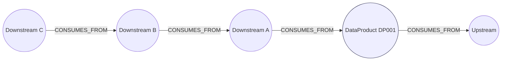

### Example

To compute downstream impact, DPOS can traverse incoming `CONSUMES_FROM` edges from consumers back to the source product and return all distinct consumer products within a maximum depth.

---

## 17) The FastAPI backend: routes, middleware, and lifecycle

DPOS’s backend centers around a FastAPI app with a deliberate middleware stack. Request logging provides traceability. Rate limiting protects the platform under load or misuse. Request validation ensures structured inputs. Security headers harden the response surface. A global error handler prevents leaking stack traces and normalizes failures.

The application lifespan initializes key resources, including Neo4j schema constraints. This ensures new environments are self-bootstrapping.

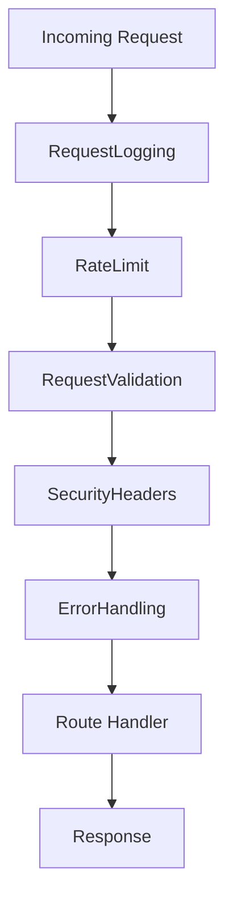

### Example

If ingestion endpoints receive malformed payloads or too many requests per minute, the middleware stack rejects the request before it consumes deeper resources like LLM calls or Neo4j sessions.

---

## 18) Security: JWT, API keys, roles and scopes

DPOS includes a security module supporting JWT access tokens and optional API key access. This enables multiple integration styles: humans in the UI can authenticate via bearer tokens, while automated systems can be provisioned an API key for service-to-service calls. The module also introduces role and scope enforcement helpers that plug naturally into FastAPI dependencies.

The security story matters because governance tools often have authority: they can block data, expose products, or write operational state. In practice you want least privilege: read-only catalog browsing is not the same as “trigger a healing agent and change incident status.”

### Example

A “steward” role might have permissions to approve a remediation plan in a human-in-the-loop workflow, while a “service” API key can ingest data and fetch health but cannot change governance policy.

---

## 19) Observability: tracing and metrics inside the platform itself

DPOS implements an internal tracing and metrics collection layer. Tracing creates spans with trace IDs and operation names and can export them to console (and later to external exporters). Metrics include counters, gauges, histograms, and timing measurements.

This is important because AI and graph systems can become opaque under load. Observability helps answer operational questions like “Which endpoints are slow?”, “Are we timing out on Neo4j?”, and “How many LLM calls are failing today?”

### Example

If the marketplace search is slow, a trace can reveal whether the bottleneck is embedding generation (Ollama) or Neo4j retrieval. A timer histogram can show p95 and p99 latencies for key operations.

---

## 20) Knowledge extraction: turning documents into graph facts

DPOS includes a document processor that chunks Markdown, text, and JSON into overlapping segments. A separate ontology-guided extractor then applies a hybrid strategy: deterministic regex patterns for obvious entities and relationships, plus optional LLM extraction for implicit or complex signals. The extractor validates results against the ontology to avoid producing nonsensical types.

The philosophy here is pragmatic. Regex is fast and precise for IDs and explicit phrases. LLMs are better for extracting implicit governance claims like ownership, requirements, or dependencies expressed in natural language.

```mermaid
flowchart TB
  DOC[Document or Text] --> CH[Chunking with overlap]
  CH --> RX[Regex extraction]
  CH --> LLM[LLM extraction (optional)]
  RX --> MERGE[Merge + dedupe]
  LLM --> MERGE
  MERGE --> VAL[Validate vs Ontology]
  VAL --> OUT[Entities + Relationships]
  OUT --> G[(Neo4j graph update)]
```

### Example

Feed a short runbook paragraph: “DP003 Marketing Segments consumes from DP001 Customer Master; email must match *@company.com; owned by Marketing team.” The regex layer catches product references and simple patterns; the LLM layer can infer that “owned by Marketing team” implies a domain/team association even if it is not written in an ID-like format.

---

## 21) Hybrid RAG: deciding how to answer questions

DPOS uses a hybrid retrieval strategy: some questions are best answered by graph queries (counts, lineage traversal, open incident lists), others are best answered by semantic search (conceptual similarity and recommendations), and some are best answered by keyword lookups (exact IDs). DPOS implements an intent classifier that uses heuristics first and can fall back to an LLM when confidence is low.

This is a subtle but important design. The system does not assume that “LLM = answer.” It treats the LLM as a reasoning tool that chooses a retrieval approach, and then it grounds answers in retrieved facts.

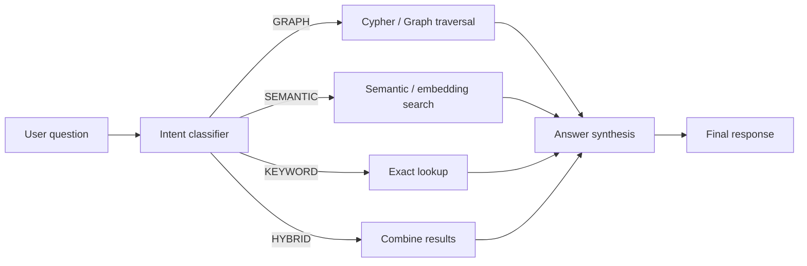

### Example

If a user asks “What depends on DP001?”, the classifier routes to graph traversal. If they ask “Explain what a data contract is and how to design one for customer data”, it routes to semantic reasoning and documentation retrieval. If they paste “DP001”, it routes to exact lookup.

---

## 22) Marketplace search: embeddings with a graceful fallback

DPOS includes a marketplace semantic search component that can generate embeddings using Ollama and store them on `DataProduct` nodes in Neo4j. When Ollama is not available, it falls back to a deterministic hash-based embedding approach so the system can still rank similarity without external dependencies.

This is another example of the platform’s resilience philosophy: AI-enhanced, not AI-dependent.

### Example

Index all products once to store embeddings, then search for “customer identity” and receive products whose name/description/type vectors are closest. If embeddings are missing, DPOS automatically falls back to keyword search.

---

## 23) Kafka and streaming enforcement: governance closer to real-time

Batch validation is valuable, but streaming validation is how you reduce blast radius when data is continuously flowing. DPOS uses a topic naming convention such as `dpos.raw.<PRODUCT_ID>` and routes validated records to `dpos.valid.<PRODUCT_ID>` or to a dead-letter queue topic like `dpos.dlq`.

The streaming enforcer maps a topic to a product ID, verifies the product exists in the graph, loads and caches the appropriate contract validator, validates each record, and publishes either the valid record or the DLQ message. This design makes enforcement scalable because validators are cached rather than reloaded for every event.

```mermaid
flowchart TB
  K1[(Kafka: dpos.raw.DP001)] --> SE[StreamingEnforcer]
  SE --> MAP[Map topic -> product, verify in Neo4j]
  MAP --> VAL[ContractValidator (cached)]
  VAL --> DEC{Action}
  DEC -->|passed| OK[(Kafka: dpos.valid.DP001)]
  DEC -->|warned/quarantined/blocked| DLQ[(Kafka: dpos.dlq)]
  DEC -->|blocked| INC[Create Incident + trigger agent]
```

### Example

A single record arrives on `dpos.raw.DP001` with `email: null`. If the contract includes a null-rate rule, the record may be routed to DLQ (depending on enforcement mode). Meanwhile, metrics record the violation and an incident can be opened if the policy is strict.

---

## 24) Enforcement engine: executing the governance decision

Validation produces a report; enforcement executes the outcome. In DPOS, enforcement actions include “passed/warned” (write valid), “quarantined” (split good/bad and send bad to DLQ), and “blocked” (do not write and create an incident). Blocking additionally triggers an agent run so the system responds instead of merely logging.

The enforcement engine is intentionally stateless: it takes a report and performs side effects. That separation is what keeps validation logic testable and enforcement logic operationally focused.

### Example

If a batch validation report says `action=blocked` for `DP001`, the enforcement engine creates an incident of type `CONTRACT_VIOLATION`, records a metric, and triggers `handle_incident(incident_id)` so a Healing Agent can propose remediation and communication.

---

## 25) The LangGraph agent system: reliable, resumable AI workflows

DPOS implements multiple agents using LangGraph, and it also ships a Supervisor Agent that acts as the global orchestrator. The set includes discovery, Q&A, healing, steward, impact, SLA monitoring, insights, predictive, orchestrator, cross-domain, notification, cypher, contract evolution, and the supervisor. The key idea is that agent execution is treated as a state machine with typed state and explicit routing. This makes agent behavior inspectable and safe enough for operations.

Under the hood, most agents share two reliability patterns that matter in real operations. First, they compile with a LangGraph checkpointer so state can be resumed or inspected. In this repo, the checkpointer is an in-memory `MemorySaver`, which is perfect for demos and tests; in production you’d typically swap to a persistent saver. Second, the system threads executions using `thread_id` so multiple concurrent incident investigations don’t overwrite each other.

```mermaid
flowchart TB
  S[Initial agent state] --> G[LangGraph StateGraph]
  G --> CP[Checkpointer\n(MemorySaver in this repo)]
  CP -->|thread_id| R[Resumable execution\n+ audit-friendly state]
```

### 25.1) The Supervisor Agent: one natural-language entry point to everything

In real data operations, the “hard part” is rarely running a single capability. A user asks something vague like “Customer data looks wrong—what changed, what broke, who’s affected, and what should we do next?” The Supervisor Agent exists to turn that one question into a deliberate, logged, multi-agent workflow.

Implementation-wise, the Supervisor is a LangGraph state machine with an explicit, auditable pipeline. It starts by classifying intent (preferably via the unified LLM, but with a deterministic keyword fallback), then builds an execution plan, then runs each selected agent, and finally synthesizes a response and persists an execution record into Neo4j.

The key detail is that planning is not done in a vacuum. The supervisor pulls *current operational context* from the graph—counts of open/critical incidents and a list of the most recent open incidents—and uses that to choose sensible defaults when the user’s request is underspecified. This is why a single query like “What’s wrong?” can still trigger a helpful plan.

DPOS exposes the Supervisor in three practical ways: a REST endpoint (`POST /api/agents/supervisor`) for “one-shot” orchestration, an SSE streaming endpoint (`POST /api/agents/supervisor/stream`) for progressive UI updates, and a capabilities endpoint (`GET /api/agents/supervisor/capabilities`) so clients can learn what it can do.

```mermaid
flowchart TB
  Q[User query] --> U[Understand: intent classification\n(LLM if available, else keyword fallback)]
  U --> C[Load context from Neo4j\n(open incidents, recent incidents, stats)]
  C --> P[Plan: build execution_plan\n(list of agent calls + params)]
  P --> E[Execute: run agents in order\ncollect results + findings]
  E --> A{Approval required?\n(e.g., healing suggests risky action)}
  A -->|Yes| W[Wait/require approval\n(status = awaiting_approval)]
  A -->|No| S[Synthesize response\n(LLM JSON synthesis or fallback)]
  W --> S
  S --> X[Persist SupervisorExecution node]\n
  X --> R[Return response + recommendations\n+ follow-up questions]
```

What makes the Supervisor more than a “router” is that it treats every invocation as an operational event. Each step is logged (understand → plan → execute_* → synthesize → persist). The output includes not only the final narrative, but also the intermediate findings and per-agent structured results so the UI (or an MCP client) can show evidence and provenance.

### Example

Here’s an example request to the supervisor endpoint that includes optional conversation history (useful for follow-ups), and enables auto-approval to avoid pausing in a demo environment.

```json
POST /api/agents/supervisor
{
  "query": "Customer Master quality dropped since this morning. Investigate, assess downstream impact, and tell me what to do next.",
  "conversation_history": [
    {"role": "user", "content": "We rely on DP001 for marketing and fraud analytics."}
  ],
  "auto_approve": true
}
```

And here is the shape of the response returned by `run_supervisor(...)` (values are representative; the exact content depends on graph state and whether an LLM provider is enabled):

```json
{
  "query": "Customer Master quality dropped since this morning. Investigate, assess downstream impact, and tell me what to do next.",
  "intent": "INCIDENT_HANDLING",
  "intent_confidence": 0.7,
  "response": "…2–3 paragraphs synthesizing what happened, what is impacted, and next actions…",
  "recommendations": ["…"],
  "follow_up_questions": ["…"],
  "agent_results": {
    "insights": {"success": true, "executive_summary": "…"},
    "healing": {"success": true, "action": "quarantine", "root_cause": "…", "requires_approval": false},
    "impact": {"success": true, "risk_score": 72, "business_impact": "…"}
  },
  "findings": ["Root Cause: …", "Risk Score: 72/100", "Business Impact: …"],
  "agents_invoked": 3,
  "status": "completed"
}
```

### 25.2) Agent catalog (what each agent does, concretely)

The easiest way to understand the agent suite is to view it as a set of “specialized operators” that all speak the same substrate: the ontology-backed knowledge graph. The supervisor decides when to involve each specialist; the MCP tools and REST endpoints let humans and other assistants invoke them directly.

The Discovery Agent exists for catalog exploration. It takes a free-form query and returns matching products and recommendations. It is intentionally pragmatic: it is optimized for “help me find the thing I need” rather than for deep reasoning.

The QA Agent provides natural-language answers and can cite sources. It is a direct question/answer interface for product metadata and governance facts.

The Hybrid QA Agent is the “Graph RAG” implementation: it classifies intent, then chooses semantic search, graph queries, keyword lookups, or a hybrid combination, and finally fuses results and generates a grounded answer. This matters because many governance questions are not purely semantic (“what is a contract?”) or purely structural (“what depends on DP001?”) — they are mixed.

```mermaid
flowchart LR
  Q[Question] --> IC[IntentClassifier\n(graph/semantic/keyword/hybrid)]
  IC -->|semantic| SS[SemanticMarketplace\n(embeddings + Neo4j)]
  IC -->|graph| GQ[Generated Cypher\n+ Neo4j query]
  IC -->|keyword| KW[Exact/id lookup\n+ simple matches]
  SS --> F[ResultFusion]
  GQ --> F
  KW --> F
  F --> SYN[Answer synthesis\n(LLM if available)]
  SYN --> A[Answer + citations\n+ generated_cypher]
```

The Cypher Agent is purpose-built for “translate my question into a safe, read-only Cypher query.” It uses ontology context plus templates for common patterns, and can fall back to an LLM when available. The important safety property is that it refuses mutations and only executes read queries.

```mermaid
flowchart TB
  Q[Question] --> P[Parse intent + entities]
  P --> G[Generate Cypher\n(template first, LLM optional)]
  G --> V[Validate query\n(block mutations)]
  V --> X[Execute read-only Cypher]
  X --> N[Generate natural answer\nfrom results]
```

The Healing Agent is the incident-first responder. It loads an incident, assesses impact, reassesses severity, and chooses a route such as escalate, auto-heal, or notify. In practice it turns “an incident exists” into “here is a recommended remediation plan (and optionally an action).”

The Steward Agent is the governance reviewer. Where the healing agent focuses on resolving the operational symptom, the steward focuses on governance improvements: preventive measures, policy recommendations, and stewardship narratives.

The Impact Agent traverses lineage and translates it into a risk narrative: downstream products, affected pipelines, affected users, and a risk score. It is the bridge between topology (graph traversal) and decision-making.

The SLA Agent monitors SLA compliance (breached / at-risk / healthy) and can add predictive guidance. It’s the reliability heartbeat of the platform: it turns time-series signals into governance priorities.

The Insights Agent is the “executive summary” generator: trends, key findings, and recommendations over a time range. It is commonly paired with the SLA agent because executives care about both governance posture and reliability posture.

The Predictive Agent forecasts upcoming risks based on historical patterns. It is how DPOS can shift from reactive incident handling to proactive prevention.

The Orchestrator Agent handles *multiple* incidents together. It correlates incidents (LLM-assisted when available), prioritizes them, then plans batch remediation when appropriate. This is particularly useful when a single upstream change causes multiple downstream incidents.

The Cross-Domain Agent evaluates impacts that cross organizational boundaries. This is not just “more lineage”; it is “what coordination is needed across teams/domains, and what is the executive summary for cross-team leadership?”

The Notification Agent generates stakeholder communications: messages tailored for different audiences and escalation actions. In practice it reduces the time between detection and clear communication.

The Contract Evolution Agent turns operational learning into governance evolution. It inspects patterns of violations and suggests threshold adjustments, new rules, and an evolution plan.

The Healing Agent is a useful illustration. It loads incident details, analyzes downstream impact, reassesses severity, then routes into either escalation, auto-heal, or notification paths. The routing depends on severity and fallback availability, and the agent persists execution results.

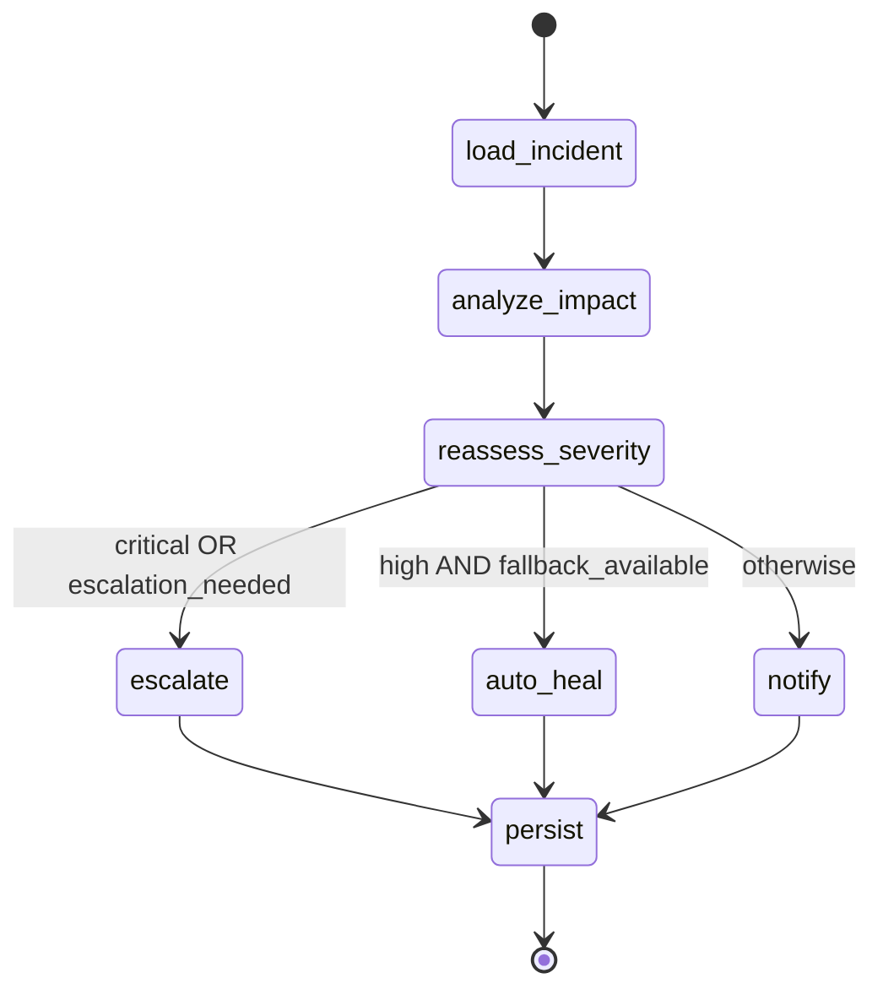

### Example

A `high` severity incident for `DP001` occurs at the same moment that a fallback pipeline is available. The Healing Agent can choose “auto_heal,” recommend activating fallback, and generate a concise stakeholder narrative. If the incident is `critical`, it routes to escalation and flags human approval.

---

## 26) Human-in-the-loop: where automation must stop

Some actions are too risky to automate blindly, especially in governance. DPOS explicitly models “requires approval” flows for critical events and orchestrator-level responses. This is not merely an ethical concern; it is operationally necessary. Automation should handle repetitive diagnostics and preparation, while humans approve irreversible changes.

In practice, DPOS treats human-in-the-loop as a routing decision: based on severity, confidence, and potential blast radius, an agent can require approval. That keeps the platform usable even in high-stakes environments.

### Example

If an agent recommends changing a contract threshold or disabling a pipeline, the system can require a steward or admin to approve. The recommendation can still include detailed rationale and a rollback plan, but the final action is not executed without review.

---

## 27) The MCP server: making DPOS callable by other assistants and tools

DPOS includes an MCP server that exposes a catalog of structured tools. These tools mirror core product capabilities such as searching products, retrieving lineage, listing incidents, handling incidents, monitoring SLAs, generating insights, extracting knowledge, and executing read-only Cypher.

The engineering value of MCP is standardization. Instead of screen-scraping the UI or asking a generic chatbot to “guess” how to use your API, external clients can call a typed tool like `dpos_analyze_impact(product_id)` and get structured output that can be formatted into a narrative.

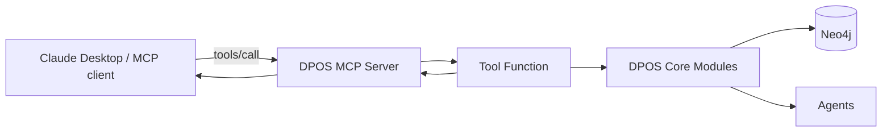

### 27.1) Tool catalog (what exists in this repo)

The MCP “tool surface” is intentionally close to the platform’s core. In this repo, tools fall into a few groups.

Core catalog tools let an assistant browse products and lineage in a way that is grounded in Neo4j. Examples include searching products (`dpos_search_products`), fetching a single product with health signals (`dpos_get_product`), and tracing lineage up and down via `CONSUMES_FROM` (`dpos_get_lineage`).

Operations tools expose incidents and dashboards. For example, `dpos_list_incidents` returns incident records joined to their products, and `dpos_get_dashboard_stats` returns summary counts and domain health rollups.

Graph query tooling exists, but it is constrained. `dpos_execute_cypher` only permits read-only queries and blocks mutation keywords (`CREATE`, `MERGE`, `DELETE`, `SET`, etc.). This gives assistants the expressive power of Cypher without letting them rewrite operational state.

Agent tools map directly to core agent workflows. For example, `dpos_handle_incident`, `dpos_steward_review`, and `dpos_analyze_impact` run the corresponding agent flows and return structured results.

Knowledge extraction tools bridge unstructured text into structured graph facts. `dpos_extract_knowledge` runs the ontology-guided extractor and returns extracted entities, relationships, and confidence.

Finally, governance listing tools expose contracts and SLAs for inspection. In this repo those include `dpos_list_slas`, `dpos_list_contracts`, and `dpos_get_contract_rules`.

### 27.2) How it looks in Claude Desktop (example transcript)

Medium can’t embed the actual Claude Desktop UI, but the interaction pattern is consistent: the user asks a question, Claude decides to call a tool, the tool returns structured JSON, and Claude turns that into a narrative answer. The following transcript is written to match the actual tool names and response shapes implemented in this repo.

**User (in Claude Desktop):** “List open high/critical incidents and tell me which product is most impacted.”

**Claude → Tool call:**

```json
{
  "tool": "dpos_list_incidents",
  "arguments": {"status": "open", "severity": "critical"}
}
```

**Tool result (DPOS → Claude):**

```json
[
  {
    "id": "INC_20260103_001",
    "type": "CONTRACT_VIOLATION",
    "severity": "critical",
    "status": "open",
    "description": "Spike in missing customer_email values",
    "product_name": "Customer Master",
    "product_id": "DP001"
  }
]
```

**Claude (final answer):** “There is 1 critical open incident, and it is tied to DP001 (Customer Master). Because DP001 is typically an upstream identity product, it’s likely to have broad downstream impact. Next I’ll trace lineage to quantify which consumers depend on it.”

**User:** “Show me the downstream lineage of DP001.”

**Claude → Tool call:**

```json
{
  "tool": "dpos_get_lineage",
  "arguments": {"product_id": "DP001", "direction": "downstream", "depth": 3}
}
```

**Tool result:**

```json
{
  "product_id": "DP001",
  "upstream": [],
  "downstream": [
    {"id": "DP020", "name": "Marketing Segments", "distance": 1},
    {"id": "DP021", "name": "Fraud Features", "distance": 1},
    {"id": "DP022", "name": "Customer Analytics", "distance": 1}
  ]
}
```

**Claude (final answer):** “DP001 directly feeds DP020, DP021, and DP022. If DP001 quality regresses, these consumers are immediately at risk. If you want, I can run impact analysis to produce a risk score and mitigation suggestions.”

**User:** “Do the impact analysis and propose mitigations.”

**Claude → Tool call:**

```json
{
  "tool": "dpos_analyze_impact",
  "arguments": {"product_id": "DP001"}
}
```

**Tool result:**

```json
{
  "product_id": "DP001",
  "risk_score": 72,
  "business_impact": "Downstream analytics and model features receive incomplete identity signals",
  "downstream_products": 3,
  "affected_pipelines": 1,
  "affected_users": 0,
  "mitigation_suggestions": [
    "Quarantine invalid records while mitigation is in progress",
    "Activate fallback source if available",
    "Backfill missing emails for the affected time window"
  ]
}
```

**Claude (final answer):** “DP001 has a risk score of 72/100 with three direct consumers. The safest mitigation is to quarantine invalid records while you roll back or hotfix the upstream producer, then backfill the affected window. If you want an automated incident response plan, I can run the incident-handling agent next.”

This transcript illustrates the core DPOS pattern: tools return structured, graph-grounded facts; Claude converts them into an operator-friendly narrative.

### Example

A user asks in Claude Desktop: “List open critical incidents.” Claude can call an MCP tool that queries Neo4j for open critical incidents, then formats a short report. If the user follows up with “Handle INC001,” Claude can call `dpos_handle_incident` and present the agent’s remediation steps.

---

## 28) The frontend: operational UX for governance workflows

The React/Vite frontend organizes DPOS into pages such as dashboard, products, product detail, domains, contracts, incidents, lineage, pipelines, policies, marketplace, agents, intelligence, ingestion, and human review. It uses an API client layer (Axios) and TanStack Query for server-state caching and periodic refresh.

The frontend matters because governance is interactive. Operators need to see health summaries, drill into a product, inspect lineage graphs, review contract violations, and manage incident lifecycles.

### Example

A dashboard can refresh every 30 seconds to show total products, active contracts, open incidents, and overall health score. If open incidents rise, an operator can click into the incidents page, then drill into the affected product’s lineage to find downstream dependencies.

---

## 29) Configuration and environment: keeping behavior explicit

DPOS centralizes configuration through environment variables (and optional config YAML). This includes Neo4j connectivity, JWT settings, rate limiting thresholds, CORS origins, file upload limits, Kafka bootstrap servers, and LLM provider configuration.

Configuration is part of the governance story. For example, rate limiting and CORS affect who can access and automate governance endpoints; LLM provider settings determine whether narratives and advanced reasoning are available.

### Example

In a dev environment you might set `OLLAMA_BASE_URL` and use a local model, while in production you might disable local LLM and use a managed provider. DPOS’s unified LLM interface means agents still call the same API; only the provider changes.

---

## 30) Testing strategy: validating governance logic safely

DPOS includes unit tests for models, contract validation, rule engines, agent routing, and API endpoints, plus optional integration tests that require Neo4j. This is essential: governance systems must be predictable and safe. Tests confirm that the same contract and rule definitions produce the same outcomes across refactors, and that agent routing behaves correctly when severity or fallback availability changes.

### Example

A test can mock Neo4j queries so that the contract validator loads a null-rate rule, then verify that a batch with 50% nulls is detected as failed. Another test can assert that a `critical` incident routes the Healing Agent into escalation rather than auto-heal.

---

## 31) Deployment: local dev and Docker compose

DPOS supports local development with a Python virtual environment and a separate frontend dev server. For containerized environments, a Dockerfile builds the backend and docker-compose can start the API, frontend, Neo4j, and Ollama together. This setup is practical because a governance platform is inherently multi-service, and developers need a one-command way to run the whole stack.

### Example

A typical “demo loop” is: start docker-compose, run scripts to load sample data into Neo4j, run a demo script like the enforcement or healing demo, then open the dashboard to see incidents and health update.

---

# A complete walkthrough scenario (real-world, with inputs + outputs)

To make the entire system concrete, here is one realistic thread that exercises the platform end-to-end: ontology and graph modeling, contracts and policies, Kafka streaming enforcement, incident creation, agent workflows, supervisor orchestration, human-in-the-loop, observability signals, and the frontend operator experience.

### Scenario: “Customer Master email quality regression”

Assume you have a `Customer` domain and a `DP001 Customer Master` data product. The product has a schema with a PII field `customer_email`, a contract that includes a `pattern` rule (valid email format) and a `null_rate` rule (nulls ≤ 5%), plus an SLA that expects freshness under one hour. This is the governance baseline: it is not just documentation; it is executable validation and monitored reliability.

Now imagine an upstream producer deploys a change at 09:15 that inadvertently stops populating `customer_email` for new customers. Records keep flowing, but quality silently degrades. This is exactly the kind of operational problem DPOS is designed to surface quickly and handle consistently.

To extend the scenario beyond “detect and respond,” we’ll also show how DPOS turns the incident into long-term improvements: knowledge extraction into the graph, contract evolution recommendations, and predictive prevention.

### 1) Input: a streaming record arrives on Kafka

An example raw event arrives on the product’s raw topic.

```json
{
  "topic": "dpos.raw.DP001",
  "key": "cust_928381",
  "value": {
    "customer_id": "928381",
    "customer_email": null,
    "created_at": "2026-01-03T09:22:31Z",
    "source_system": "crm"
  }
}
```

### 2) Output: validation + enforcement routes the event

DPOS maps `dpos.raw.DP001` → `DP001`, loads the contract (and policy overrides) from Neo4j, runs the rule engines, and produces a validation decision. If the system is configured to quarantine or block on this violation, it will route the record accordingly. A representative DLQ payload might look like this.

```json
{
  "topic": "dpos.dlq",
  "original_topic": "dpos.raw.DP001",
  "product_id": "DP001",
  "decision": "quarantine",
  "violations": [
    {
      "rule_type": "pattern",
      "field": "customer_email",
      "message": "email is null or does not match required pattern"
    }
  ],
  "record": {
    "customer_id": "928381",
    "customer_email": null,
    "created_at": "2026-01-03T09:22:31Z",
    "source_system": "crm"
  },
  "ts": "2026-01-03T09:22:31Z"
}
```

At the same time, DPOS updates operational signals: it increments violation counters, it can emit tracing spans for the validation and publish steps, and (depending on enforcement mode and severity) it creates an incident in Neo4j so the problem becomes a first-class operational object.

### 3) Output: an incident is created and linked to the product

The incident becomes the durable “unit of work” that humans and agents collaborate around. A representative API response from an incident-creation endpoint (shape varies by route implementation) would include an incident ID and status.

```json
{
  "incident_id": "INC_20260103_001",
  "product_id": "DP001",
  "type": "CONTRACT_VIOLATION",
  "severity": "high",
  "status": "open",
  "description": "Spike in missing customer_email values on streaming ingestion",
  "created_at": "2026-01-03T09:23:10Z"
}
```

Because incidents are graph entities, DPOS can immediately attach lineage context (what consumes DP001), ownership context (who owns DP001), and governance context (which contract and rules were violated).

### 4) Input: the supervisor is asked to handle the situation end-to-end

Instead of calling individual agent endpoints manually, an operator (or MCP client) can issue a single natural-language request to the Supervisor Agent.

```json
POST /api/agents/supervisor
{
  "query": "DP001 Customer Master is failing email checks. Investigate root cause, assess downstream impact, and draft a stakeholder update.",
  "conversation_history": [],
  "auto_approve": true
}
```

### 5) Output: supervisor planning → multi-agent execution → synthesis

Internally, the supervisor classifies intent (often `INCIDENT_HANDLING`), pulls current context from Neo4j (for example, the most recent open incident tied to DP001), builds an execution plan, runs each agent, and synthesizes a response. The returned object includes the final narrative, plus evidence: per-agent structured results and intermediate findings.

```json
{
  "intent": "INCIDENT_HANDLING",
  "agents_invoked": 3,
  "findings": [
    "Root Cause: Upstream CRM change stopped populating customer_email",
    "Risk Score: 72/100",
    "Business Impact: Marketing Segmentation and Fraud Features degraded"
  ],
  "agent_results": {
    "healing": {
      "success": true,
      "action": "quarantine",
      "root_cause": "Upstream producer regression (crm)",
      "remediation_steps": [
        "Roll back CRM change or hotfix email mapping",
        "Backfill missing emails for affected window",
        "Keep quarantining records until null-rate returns under threshold"
      ],
      "requires_approval": false
    },
    "impact": {
      "success": true,
      "risk_score": 72,
      "business_impact": "Downstream analytics and model features receive incomplete identity signals",
      "downstream_count": 3
    },
    "notification": {
      "success": true,
      "notifications": [
        {
          "audience": "Data consumers",
          "subject": "DP001 Customer Master: email field quality incident",
          "message": "We detected missing customer_email values… mitigation in progress…"
        }
      ]
    }
  },
  "response": "…2–3 paragraphs tying together what happened, who is impacted, and what actions are recommended…",
  "recommendations": ["…"],
  "follow_up_questions": ["…"],
  "status": "completed"
}
```

### 6) What the UI shows (and why this closes the loop)

From the frontend’s perspective, this incident now appears as an open operational item on the dashboard and the incidents page. The product detail view can show contract violations, current health signals, and lineage-driven impacted consumers. If the supervisor (or healing agent) flags “requires approval,” the human review workflow becomes the explicit gating step before executing any risky remediation.

The most important outcome is that the entire episode is captured as structured state: a contract violation tied to a product, an incident with a lifecycle, downstream impact grounded in lineage traversal, and agent executions recorded for auditability and future learning (for example, contract evolution suggestions).

### 7) Extending the loop: ingest a runbook and convert it into graph facts

After the incident, teams usually write a short runbook: what happened, how to mitigate, and how to prevent recurrence. DPOS can treat that document as a knowledge source. Using the knowledge extraction tool, you can extract products, rules, ownership references, and relationships, then materialize those into graph updates.

```json
{
  "tool": "dpos_extract_knowledge",
  "arguments": {
    "source": "runbook",
    "text": "DP001 Customer Master consumes from DP011 Identity Resolution. Email must match corporate pattern. Owned by Customer Data team. If null-rate exceeds 5%, quarantine and notify stakeholders."
  }
}
```

The extracted entities and relationships can be reviewed by a steward before being written to Neo4j, which is a practical way to keep the graph aligned with reality without asking engineers to hand-edit graph data.

### 8) Extending the loop: evolve contracts based on violation patterns

When the same type of violation repeats, the Contract Evolution Agent can recommend governance changes instead of relying on tribal knowledge. For example, it might recommend tightening thresholds for PII fields, adding a freshness rule, or introducing a new rule type for producer-side completeness checks.

### 9) Extending the loop: predictive prevention

Once DPOS has a history of incidents, rule violations, and remediation outcomes, the Predictive Agent can be used to forecast which products are trending toward breach or likely to regress. This shifts governance from reactive firefighting to proactive prevention.

---
